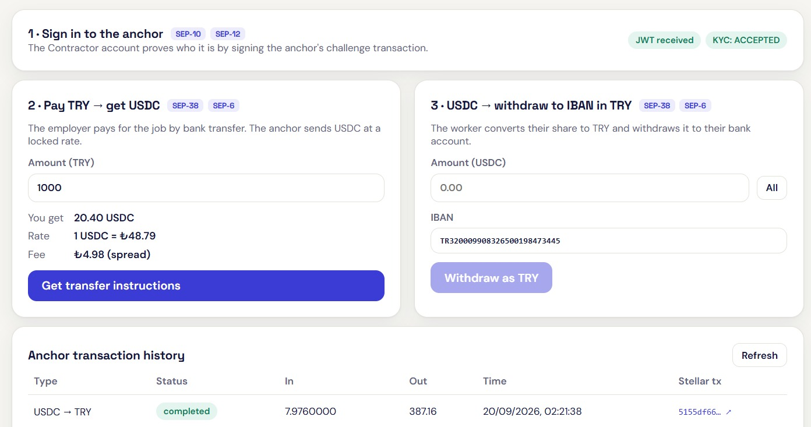
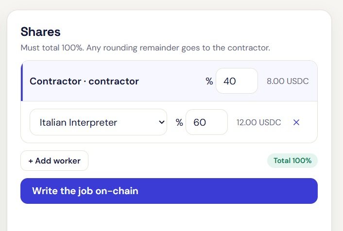
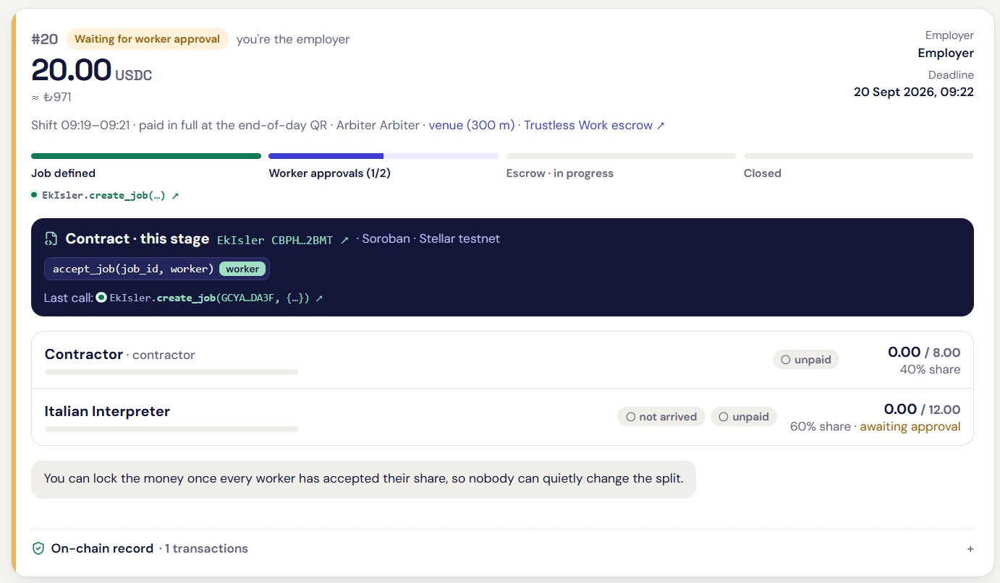
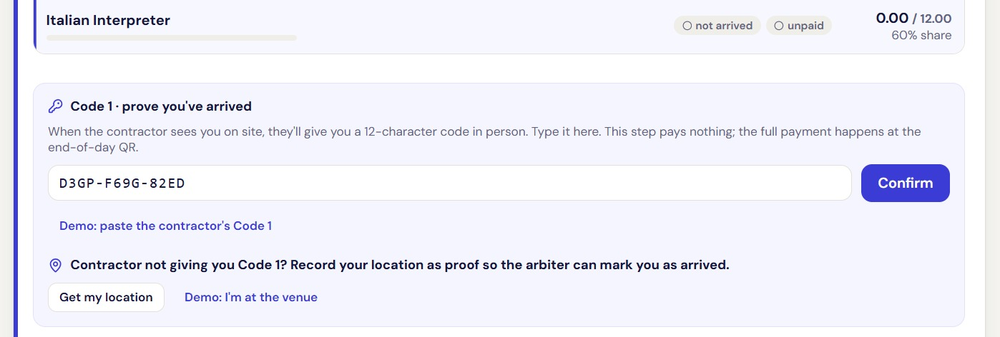
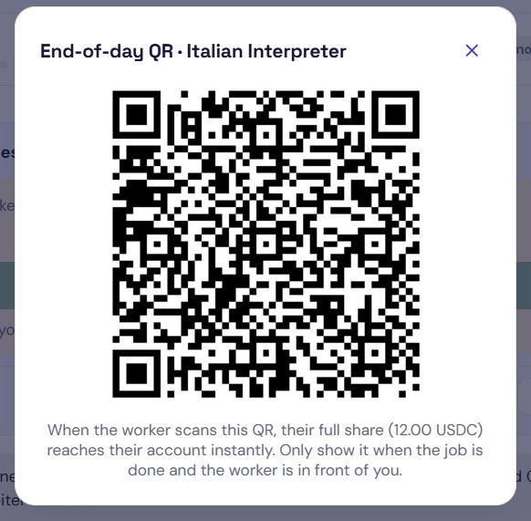
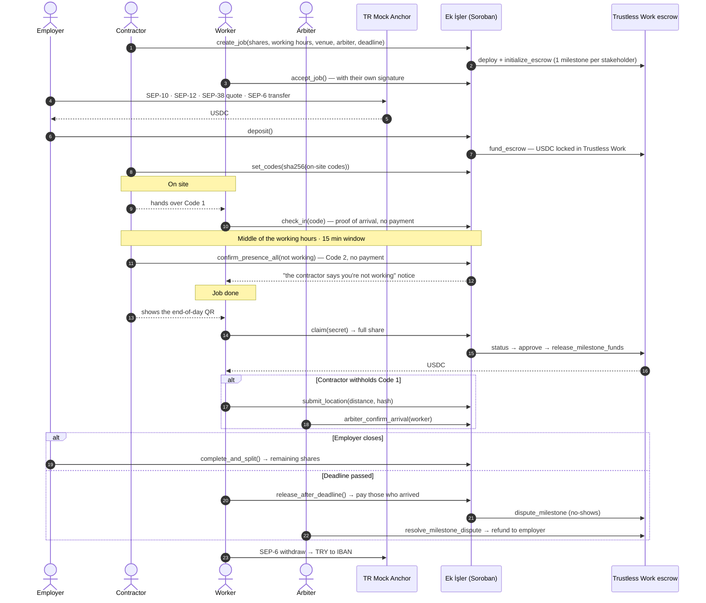
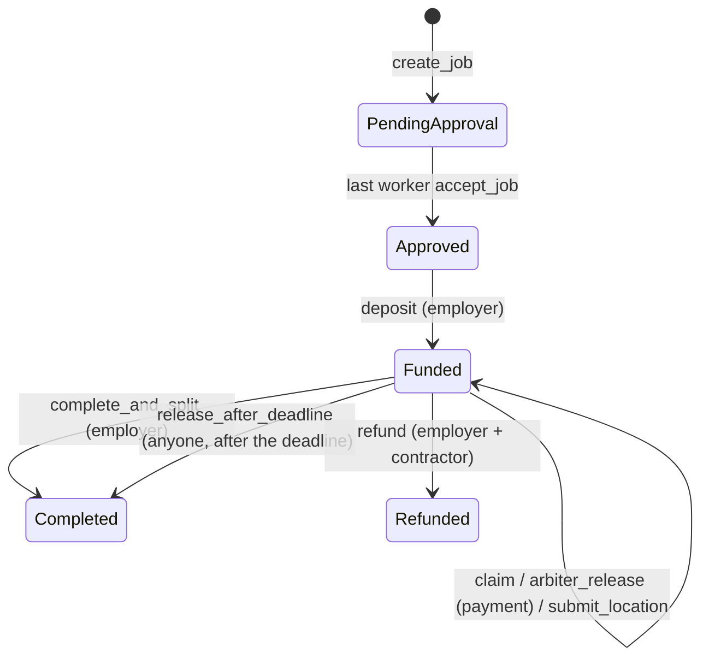

# Ek İşler

**[English](#english) · [Türkçe](#türkçe)**

Stellar Hackathon Türkiye 2026 · Stellar Testnet · Soroban + **Trustless Work** escrow + TR Mock Anchor (SEP-1/10/12/38/6) + Stellar Wallets Kit

**Live demo:** [ekisler.vercel.app](https://ekisler.vercel.app) · **Contract:** [`CBPHNMV5…72BMT`](https://stellar.expert/explorer/testnet/contract/CBPHNMV5DZ3IFT43GRQ6NS65U5W6KTRBENHK3NWFUXJCWTIK3BD72BMT)

**Track:** Genesis · **Team:** Miraç Altunbay · Yunus Büber · Mehmet Emin Öncü

Built from zero at the event: we arrived with a different idea, dropped it on day one, and shipped this in two days — contract, frontend, anchor integration and the end-to-end scripts.

**Evaluating this?** [Five-minute route](#for-judges-evaluate-in-5-minutes) · [Stellar Skills we used](#stellar-skills-we-used) · [Architecture](#architecture)

---

<a id="english"></a>

# English

**A payment split for short-term gigs where the money sits in a smart contract instead of with a middleman. Every worker signs off on their own share, and on-site steps are proven with codes and a QR.**

## Who this is for

**Anyone who can take on work on the side.** The people this is built for are not defined by a profession but by a situation: whatever their main job is, they can earn on a weekend, an evening or a season. A shopkeeper who speaks Italian can interpret at a trade fair. A student can run a camera at an e-sports tournament. A retiree can join a stage build. That is what the name means — *ek işler* is Turkish for "side jobs" — and the product is deliberately open to all of them rather than to one trade.

Three roles use it. The **worker** is the person doing the side job, and what changes for them is that they get paid the moment the job ends, at exactly the share they agreed to, without having to ask anyone. The **contractor** is the crew lead who wins the job and staffs it, and what changes for them is that they can put a crew together without being the person everyone is forced to trust. The **employer** is the company or organiser paying for the work, and what changes for them is that they pay once, into code, and the shares of people who never showed up come back automatically.

Today this market runs on WhatsApp groups, Facebook groups and word of mouth. The terms are agreed verbally, the money moves through one person, and the worker's only guarantee is that person's goodwill.

**Value proposition:** the worker's guarantee stops being a person and becomes a contract — and nobody has to hand custody of their money to a middleman to get it.

## Problem

Weekend e-sports tournaments, festivals, trade fairs, interpreting jobs, stage builds… A **contractor** (crew lead) wins the job and hires **workers** to deliver it (e.g. an Italian interpreter and a camera operator).

1. **Payment anxiety:** The employer pays the contractor; the contractor pays the worker late or short. The worker waits for days wondering whether the money will arrive.
2. **Hidden share fraud:** The contractor verbally agrees on 32% with a worker, then quietly enters 20% in the system.
3. **Trust on site:** The worker shows up and the employer says "you never came". Or the worker never shows up and the employer is left stranded at the last minute.
4. **Regulatory wall:** In Türkiye, a software company collecting money from clients, holding it in its own pool and distributing it to third parties needs a central bank (TCMB) licence under Law No. 6493.

## Why we built this

This is not a hypothetical. One of us watched their older sister take an Italian interpreting job, deliver it in full, and then wait a very long time to be paid. Nothing was even in dispute: the work was done and both sides agreed on the amount. The money just sat somewhere between the parties, and she had no way to see where it was or to claim it.

That story has not gone away, and it is not specific to Türkiye — short-term workers run into the same wall all over the world. It is the reason we came to Stellar and to a blockchain in the first place. Our goal was never just to move a payment faster; it was to take the trust the two sides are forced to place in each other and put it into code, so that getting paid stops depending on the other party's goodwill.

That conversation is also our user research. Before we wrote a line of code, the problem had been described to us by someone who lived it: a real short-term worker, a job delivered in full, a payment that did not arrive. Every rule in the contract below traces back to something that went wrong in that story.

We did not arrive at the hackathon with this idea. We came with a different one, spent the first hours talking through problems that actually hurt, and this was the one that kept coming back. We dropped what we had and built Ek İşler from zero in two days.

## Solution

The money never enters any company's account. It is locked in a **Trustless Work multi-release escrow** opened for each job, and the job's rules are enforced in code by the **Ek İşler Soroban contract**:

| Rule | How it is enforced |
|---|---|
| No share fraud | The contractor writes the shares, but the employer **cannot fund the job until every worker has accepted their own share with a wallet signature**. The contractor cannot fill in approvals on anyone's behalf. |
| **Code 1** · in-person check-in | On site, the contractor gives the worker a 12-character code (`K7M2-QX9F-4B3T`) **in person**; when the worker types it into the app, their arrival is written on-chain. **No money moves.** |
| **Code 2** · roll call | Exactly **in the middle of the working hours** entered when the job was created, the contractor gets a single notification that stays open for **15 minutes**: "are the workers on site and working?". The contractor marks anyone who isn't; each marked worker **instantly gets a notice**: *"The contractor says you're not working."* The window is enforced on-chain; no roll call is possible outside it. **No money moves.** |
| **End-of-day QR** · payment | The only step that moves money. When the job is done, the contractor shows the QR, the worker scans it, and **the full share** reaches their account instantly. |
| **Location** · tracking | Starts **automatically** when Code 1 is entered, ends at the end-of-day payment, and is processed **on the worker's device**. If the worker leaves the venue, only the distance is written on-chain and the contractor is notified. Raw coordinates never go on-chain. |
| If the contractor withholds Code 1 | The worker records a location proof (distance + hash of the raw reading); the **arbiter** agreed on up front marks them as arrived, so they are included in the deadline payout. |
| The employer is protected too | If the deadline passes without the employer closing the job, workers who showed up get their shares and **the shares of no-shows go back to the employer**. |
| No middleman holds the money | Each stakeholder's share is a separate **milestone** in the Trustless Work escrow whose receiver is that stakeholder. The Ek İşler contract only approves and releases a milestone when its condition is met; the money never sits with Ek İşler. |
| Disputes | The milestones of workers who never showed up are moved into **dispute** on Trustless Work; the arbiter (dispute resolver) refunds them to the employer. |
| Turkish lira in and out | The employer sends a TRY bank transfer → the anchor converts it to USDC (SEP-38 + SEP-6). The worker withdraws USDC to their IBAN in TRY. |

**Layers and privacy:** Only money and decision trails live on-chain: code hashes, who arrived, Code 2 answers, distance when leaving the venue. Raw GPS coordinates, identities and IBANs are never written on-chain. Location readings (with salted hashes) stay on the worker's device; in a dispute they can be shown to the arbiter and checked against the on-chain hash. Leaving the venue or a "not working" answer **never opens a dispute automatically**; they are notices only (to avoid false alarms from GPS drift), and the arbiter decides.

**Why are the codes safe?** The contractor's device generates both codes for every worker: a 12-character Code 1 and a 32-byte random end-of-day secret. Only their **sha256 hashes** go on-chain (`set_codes`); the codes themselves never leave the contractor's device. Each code belongs to one worker; someone else's code or a second use is rejected.

## For judges: evaluate in 5 minutes

Nothing to install. Open [ekisler.vercel.app](https://ekisler.vercel.app) in a single tab — the testnet demo accounts are already there, and roles are switched from the top of the screen.

1. **Employer → TRY ⇄ USDC.** Sign in, pass the KYC step, take a quote for 1000 TRY and send the transfer; around 20 USDC arrives. This is a full anchor round trip — SEP-10, SEP-12, SEP-38, SEP-6 — lira in, spendable balance out.
2. **Contractor → New job.** Pick the employer, 20 USDC, shares of 40 / 30 / 30, the *2 min* working-hours preset, venue Grand Pera, and the arbiter. `create_job` deploys a Trustless Work escrow for this job with one milestone per stakeholder.
3. **Now try to fund it before the workers have accepted.** The contract refuses with `NotAllAccepted`. The contractor cannot write a share the worker has not signed for; the anti-fraud rule is enforced, not promised.
4. **Workers accept, the employer funds, the contractor creates the on-site codes.** The money is now in the Trustless Work escrow. It was never in an account we control.
5. **Worker → type Code 1.** Watch the balance: nothing moves. Attendance and payment are separate steps by design.
6. **Worker → scan the end-of-day QR.** The full share lands instantly. This is the one step that moves money, released out of Trustless Work.
7. **Open "On-chain record" on the job card.** Every step above, decoded from the real transaction and linked to stellar.expert.

If you only have one minute, do steps 6 and 7.

Prefer reading to clicking? The sample transactions in the Testnet section below are the same flow already on testnet, and at the time of writing the contract has served 148 invocations with zero errors.

### What it looks like

The product is built for someone who has never touched crypto: the demo accounts arrive funded, roles are switched from one browser, the USDC trustline is opened for the worker at the accept step, and every screen reads in English or Turkish.



**The fiat rail.** The employer pays 1000 TRY and receives 20.40 USDC at a rate locked by SEP-38, and the worker converts a share back and withdraws it to an IBAN. The history underneath is real SEP-6 traffic against the anchor, each row linked to its Stellar transaction.



**The split is written before any money exists.** Shares must total 100% and any rounding remainder goes to the contractor. *Write the job on-chain* is `create_job`, which also deploys this job's Trustless Work escrow.



**The job card is the entire state of the job.** Stage, each stakeholder's share and status, the contract panel naming the function callable right now and who may call it, the last on-chain call, and the on-chain record. The line at the bottom is the anti-fraud rule in plain words: the employer cannot lock the money until every worker has accepted their own share.



**Code 1 proves arrival and pays nothing.** The contractor hands the twelve-character code over in person. If they withhold it, the worker records a location proof instead and the arbiter can mark them as arrived.



**The end-of-day QR is the only step that moves money.** The worker scans it and their full share — here 12.00 USDC — reaches their account instantly.

## Demo flow (≈4 min)

The app has ready-made **testnet demo accounts**: Employer, Contractor, two workers (Italian Interpreter, Camera Operator) and Arbiter. **Add role** creates more worker accounts (e.g. "Waiter"). Switch roles in one browser to show the whole flow, or use **Connect your own wallet** (Freighter, xBull, Lobstr, …) to play any role with a real wallet. The UI is in English by default; TR/EN is switchable at the top right.

1. **Set up demo accounts**: Friendbot XLM + USDC trustline for every account, then ~20 test USDC for the employer through the anchor (SEP-6).
2. **Employer → TRY ⇄ USDC**: sign in with the wallet (SEP-10) → KYC (SEP-12) → quote for 1000 TRY (SEP-38) → transfer instructions (SEP-6 deposit-exchange) → *Send the transfer* → ~20 USDC arrives.
3. **Contractor → New job**: employer, 20 USDC, shares 40% / 30% / 30%, **working hours** (the *2 min* preset for the demo), venue (Grand Pera), arbiter → `create_job`. The form shows exactly when the Code 2 roll call will open.
4. **Workers → Jobs**: *Accept my share and the terms* (`accept_job`).
5. **Employer**: *Lock the money in escrow* (`deposit`). **Contractor**: *Create on-site codes* (`set_codes`) → Code 1 and an end-of-day QR are ready for each worker.
6. **Italian Interpreter**: the contractor taps *Show Code 1*, the worker types it (`check_in`) → **no money moves**, "arrived" is written on-chain. Location tracking starts automatically (*Demo: leave the venue* in the demo).
7. **Contractor**: sees the left-the-venue alert. In the middle of the shift the **Code 2 notification** arrives with a 15-minute countdown: mark anyone not working and send (`confirm_presence_all`). The marked worker instantly sees "the contractor says you're not working". No money moves.
8. **Camera Operator**: the contractor won't give Code 1 → *Get my location* → *Submit as proof* (`submit_location`). **Arbiter**: 37 m from the venue → *Mark as arrived* (`arbiter_confirm_arrival`).
9. **Italian Interpreter**: the job is done, they scan the contractor's *end-of-day QR* (`claim`) → **the full share** arrives instantly. **Employer**: *Close the job* (`complete_and_split`) → the remaining shares are paid.
10. **Italian Interpreter → TRY ⇄ USDC**: *All* → *Withdraw as TRY* (SEP-6 withdraw).

Every job card shows a **"Contract · this stage"** panel (the contract address, the functions callable at this stage and who calls them, and the last on-chain call) and an **"On-chain record"** that lists every step as the real contract call decoded from the transaction, e.g. `EkIsler.check_in(7, GCTZ…, 0x435a…)`, each linked to stellar.expert.

## Architecture

### Trustless Work integration

```
Employer ──fund──▶ Trustless Work multi-release escrow (one per job)
                     milestone 0: contractor's share   → receiver: contractor
                     milestone 1: worker 1's share     → receiver: worker 1
                     milestone 2: worker 2's share     → receiver: worker 2
                     …
                     roles: approver, service provider, release signer, platform = Ek İşler contract
                            dispute resolver = arbiter
Ek İşler contract: verifies the end-of-day QR → change_milestone_status → approve_milestone → release_milestone_funds
```

- The escrow contract is built from Trustless Work's official repository ([`trustlesswork-smart-contract-stellar`](https://github.com/Trustless-Work/trustlesswork-smart-contract-stellar), `multi-release-develop`, testnet line); its wasm lives in [`vendor/trustless-work`](vendor/trustless-work). During `create_job`, the Ek İşler contract deploys a job-specific escrow from this wasm and calls `initialize_escrow`.
- The escrows show up in Trustless Work's own **[Escrow Viewer](https://viewer.trustlesswork.com)**: V1 · Multi-release, roles, milestones and all events.
- Trustless Work charges a **0.3% protocol fee** on every release (the fee address is a parameter on testnet and hard-coded on mainnet).
- Trustless Work emits the whole escrow as an event on every approval, so closing runs in batches of at most 3 milestones to stay under the 16 KB per-transaction event limit (`continue_close`; the UI continues automatically).





### Components

| Folder | Contents |
|---|---|
| [`contracts/ek_isler`](contracts/ek_isler/src/lib.rs) | Soroban contract (Rust, soroban-sdk 28) + [24 unit tests](contracts/ek_isler/src/test.rs); the tests run against the real Trustless Work wasm |
| [`vendor/trustless-work`](vendor/trustless-work) | Trustless Work multi-release escrow wasm (source and commit in `SOURCE.txt`) |
| [`frontend/src/lib/contract.ts`](frontend/src/lib/contract.ts) | Contract client (`@stellar/stellar-sdk` `contract.Client`, spec read from the chain) |
| [`frontend/src/lib/codes.ts`](frontend/src/lib/codes.ts) | On-site codes: generation, sha256 commitments, QR format, distance |
| [`frontend/src/lib/events.ts`](frontend/src/lib/events.ts), [`txinfo.ts`](frontend/src/lib/txinfo.ts) | Per-job on-chain record from contract events; the contract call of each transaction decoded from its envelope |
| [`frontend/src/lib/camera.ts`](frontend/src/lib/camera.ts) | Camera permission and stream for QR scanning, with clear error states |
| [`frontend/src/lib/anchor.ts`](frontend/src/lib/anchor.ts) | SEP-1, SEP-10, SEP-12, SEP-38, SEP-6 client |
| [`frontend/src/lib/wallet.ts`](frontend/src/lib/wallet.ts) | Stellar Wallets Kit integration + demo accounts and user-added roles |
| [`frontend/src/lib/i18n.ts`](frontend/src/lib/i18n.ts) | English / Turkish UI |
| [`frontend/scripts/e2e.ts`](frontend/scripts/e2e.ts) | Headless end-to-end testnet scenario |
| [`frontend/scripts/e2e-dispute.ts`](frontend/scripts/e2e-dispute.ts) | No-show worker → Trustless Work dispute → arbiter refund scenario |

### Stellar tooling

The contract is built on `soroban-sdk` 28. The frontend uses `@stellar/stellar-sdk`, where the contract client reads its interface spec **from the chain** rather than from generated bindings. Building, uploading and deploying go through the Stellar CLI 23 or later. Soroban RPC handles simulation and submission while Horizon serves balances and payments; contract events are read back per job and each transaction's real call is decoded from its envelope, which is what the on-chain record panel in the UI shows. Testnet accounts are funded through Friendbot, contract-side transfers go through the USDC Stellar Asset Contract, and every connection and signature — including the SEP-10 challenge — goes through Stellar Wallets Kit.

### Contract interface

| Function | Called by | What it does |
|---|---|---|
| `create_job(contractor, terms) -> u64` | Contractor | Validates the terms and deploys the job's **Trustless Work escrow** with its milestones. Shares total 100%, no duplicate addresses, the arbiter can't be a party, working hours can't go past the deadline. |
| `accept_job(job_id, worker)` | Worker | Accepts their share and the terms with their signature. The last approval moves the job to `Approved`. |
| `deposit(job_id)` | Employer | Locks the **full job amount** in the Trustless Work escrow (`fund_escrow`). Despite the name, this is not a down payment: no worker is paid at this step. |
| `set_codes(job_id, commitments)` | Contractor | Stores the sha256 of each stakeholder's Code 1 and end-of-day secret. Can be renewed for unpaid shares (if the contractor switches devices). |
| `check_in(job_id, worker, code)` | Worker | **Code 1**: verifies the code handed over in person and marks the worker as *arrived*. **No money moves.** |
| `claim(job_id, worker, code) -> i128` | Worker | **End-of-day QR**: verifies the secret and releases the full share from Trustless Work. |
| `confirm_presence_all(job_id, absent)` | Contractor | **Code 2**: the answer to the contractor's single notification. Workers in `absent` get a "not working" alert; the rest count as working. The whole crew in one transaction. **No money moves.** |
| `confirm_presence(job_id, worker, present)` | Contractor | Single-worker form of Code 2, same window rule. **No money moves.** |
| `presence_window(terms) -> (u64, u64)` | Read | The roll-call window: the middle of the working hours to + 15 minutes. |
| `submit_location(job_id, worker, distance_m, reading_hash)` | Worker | Distance to the venue + hash of the raw reading. If the distance exceeds the radius, the contractor gets a "left the venue" alert. |
| `arbiter_confirm_arrival(job_id, worker)` | Arbiter | Marks the worker as *arrived* based on location proof (not a payment); includes them in the deadline payout. |
| `arbiter_release(job_id, worker) -> i128` | Arbiter | Releases a worker's share without waiting for the deadline. |
| `complete_and_split(job_id)` | Employer | Releases all open milestones (in batches). |
| `release_after_deadline(job_id)` | Anyone | After the deadline: releases the milestones of those who arrived and moves the rest into dispute on Trustless Work. |
| `continue_close(job_id)` | Anyone | Continues a batched close. |
| `refund(job_id)` | Employer **and** contractor | Mutual cancellation; paid shares stay with the workers, unpaid ones go into dispute and the arbiter refunds the employer. |
| `get_job`, `job_count` | Read | View functions. |

Events (`#[contractevent]`): `JobCreated`, `JobAccepted`, `JobFunded`, `CodesSet`, `CheckedIn`, `PresenceChecked`, `PaymentReleased`, `AlertRaised`, `LocationSubmitted`, `JobClosed`. The arbiter resolves disputes directly on the Trustless Work escrow with `resolve_milestone_dispute`.

### Authorization and storage (Soroban patterns)

Every function that changes state requires the caller's own signature. `require_auth()` appears fourteen times in the contract, and it is what makes the product rules above unforgeable rather than merely stated.

- A worker's share can only be accepted by that worker: `accept_job` calls `worker.require_auth()`, so the contractor cannot approve on anyone's behalf — and `deposit` fails with `NotAllAccepted` until every worker has signed for their own share.
- Only the employer locks the money, through `job.terms.client.require_auth()` in `deposit`.
- Only the contractor issues on-site codes and answers the roll call, through `job.contractor.require_auth()` in `set_codes`, `confirm_presence` and `confirm_presence_all`.
- Only the arbiter agreed up front can override an arrival or release a share early, through `job.terms.arbiter.require_auth()` in `arbiter_confirm_arrival` and `arbiter_release`.
- Cancelling a funded job takes both sides: `refund` requires the employer **and** the contractor to sign.
- A code belongs to exactly one worker. The caller is authenticated *and* the sha256 of the submitted code is checked against that worker's own commitment, so someone else's code — or a second use of one's own — is rejected.

**Storage.** Configuration lives in `instance` storage: the Trustless Work wasm hash, the fee address and the job counter. Every job is a separate `persistent` entry keyed by its id, so jobs never share a storage slot and one job's traffic cannot evict another's. Every read and write extends that entry's TTL to thirty days with `extend_ttl`, so an open job cannot be archived away from the people still waiting to be paid.

## Design decisions and trade-offs

- **The money sits in a Trustless Work escrow, never in an Ek İşler account.** The simpler design would have been one contract holding a pool and splitting it. We gave that up because a pool would make us the party everyone has to trust, which is the exact problem we set out to solve — and because in Türkiye, collecting client money into your own pool and paying it out to third parties requires a TCMB licence under Law No. 6493. Each share is its own milestone with the stakeholder as receiver, so there is no pool to hold.
- **Code 1 is twelve characters, the end-of-day secret is thirty-two bytes.** A single uniform code would have been simpler. But code commitments are public sha256 hashes on-chain, so a short code can be brute-forced from its hash — while Code 1 is typed by hand and cannot be long. So the step that moves money got the strongest possible secret at 256 bits, and the step that only records attendance got one that is typeable but not guessable at 60 bits, with confusable letters removed from the alphabet.
- **Location never moves money on its own.** We considered automatic penalties when a worker leaves the venue and rejected them: GPS drifts, and a worker's pay cannot hang on a bad reading. Leaving the venue raises a notice and gives the arbiter an input; only the end-of-day QR, an arbiter decision or the deadline rule releases funds.
- **Only distance and a salted hash go on-chain; raw coordinates stay on the worker's device.** This costs us the ability to verify a location claim from the chain alone. We took that cost because putting a person's movements on a public ledger is not an acceptable price for dispute resolution. The raw reading can be shown to the arbiter and checked against the on-chain hash, which gives verification without publication.
- **Attendance and payment are separate steps.** One scan could have done both. But a worker who showed up and a worker who finished the job are different facts, and splitting them is what lets the deadline rule pay people who arrived even if the contractor disappears before the end of the day.
- **The roll call is a single fifteen-minute window, fixed on-chain at the middle of the shift.** An open-ended power to mark someone "not working" is a pressure tool. One window, announced when the job is created and enforced by the contract, makes it a check rather than a lever.
- **The contractor picks the token.** This buys flexibility for future assets at the cost of needing a token allow-list before mainnet. The UI always uses testnet USDC today.
- **`refund` requires both signatures and is therefore not in the UI.** Mutual cancellation should not be something one party can drive on their own, so it is available through the CLI or a multi-sig flow instead of a button.

## Technical challenges

- **The 16 KB event limit.** Trustless Work emits the entire escrow as an event on every approval, so on jobs with several workers, closing blew past the per-transaction event limit and the transaction failed outright. Closing now runs in batches of at most three milestones through `continue_close`, and the UI continues automatically until the job is closed. This is why `complete_and_split` and `release_after_deadline` are resumable rather than single-shot.
- **The contractor switching devices.** On-site codes live on the contractor's device, so a contractor changing phones mid-job would have locked every unpaid worker out of their money. `set_codes` can now be re-issued, but only for unpaid shares: new commitments invalidate the old codes while shares already paid are untouched.
- **A missing trustline at the worst possible moment.** A worker who removed their USDC trustline after accepting would make the release transaction fail, and the failure would surface at payout time. The UI now opens the trustline automatically at the accept step, before any money is locked.
- **Testing the integration rather than a stub of it.** We wanted the contract tests to prove the Trustless Work integration itself, so the official multi-release escrow wasm is vendored in `vendor/trustless-work` with its source and commit recorded in `SOURCE.txt`, and the 24 unit tests run against that real wasm.
- **Who decides when the roll call happens.** This could not be left to the client, or a contractor could open the window whenever it suited them. `presence_window` derives the window from the job terms and the contract rejects any roll call outside it, so the countdown in the UI and the rule on the chain are the same rule.
- **Windows and Turkish characters.** Rust's MinGW linker could not find files under a path containing Turkish characters. Keep the path plain ASCII, or redirect the build output with `CARGO_TARGET_DIR`.
- **IPv6 timeouts against the anchor.** Node resolved the anchor over IPv6 and the connection timed out in the headless scripts. Running them with `node --dns-result-order=ipv4first` fixes it.

## Testnet

| | |
|---|---|
| Ek İşler contract | [`CBPHNMV5DZ3IFT43GRQ6NS65U5W6KTRBENHK3NWFUXJCWTIK3BD72BMT`](https://stellar.expert/explorer/testnet/contract/CBPHNMV5DZ3IFT43GRQ6NS65U5W6KTRBENHK3NWFUXJCWTIK3BD72BMT) |
| Trustless Work escrow wasm hash | `3c42a38069af01f4332aba5e5817bf0415070d5f47d184a9c42c5133433af6d0` |
| Sample Trustless Work escrow | [`CCP4T3O5…` in the Escrow Viewer](https://viewer.trustlesswork.com/testnet/v1/CCP4T3O5SC6BG23XGYU32RRQ3VM6E2NF6F2XVVTHMEL3CP7NEGTRPQ7J) |
| USDC (SAC) | `CBIELTK6YBZJU5UP2WWQEUCYKLPU6AUNZ2BQ4WWFEIE3USCIHMXQDAMA` (issuer `GBBD47IF…LFLA5`) |
| Anchor | [`tr-mock-anchor.fly.dev`](https://tr-mock-anchor.fly.dev) |
| Ek İşler contract wasm hash | `047b5a95dd49d8af9f1af4718e22e6ea4e64a253aa790a2d46a53d8c835d7079` |
| Live usage at the time of writing | 148 invocations · 164 events · 0 errors |

The deployed wasm can be pulled down and hashed to confirm it is the contract described here: `stellar contract fetch --id CBPHNMV5DZ3IFT43GRQ6NS65U5W6KTRBENHK3NWFUXJCWTIK3BD72BMT --network testnet --out-file ek_isler_onchain.wasm`, then `sha256sum ek_isler_onchain.wasm`.

Sample transactions (job #9 with three workers, plus the arbiter, location and withdrawal steps from the end-to-end script):

| Step | Transaction |
|---|---|
| `create_job` + Trustless Work escrow deploy | [`3a8b9011…`](https://stellar.expert/explorer/testnet/tx/3a8b9011b697e77d0941efe98c9aacb5625eec4f7205ce91d9151029175b9d0d) |
| `accept_job` (worker signature) | [`3e0845c9…`](https://stellar.expert/explorer/testnet/tx/3e0845c91b7151bc89a266eeabd453e858121e641d6f9c059e36f9c60a7f6753) |
| `deposit` → `fund_escrow` | [`d9f52a3c…`](https://stellar.expert/explorer/testnet/tx/d9f52a3c344b798ee004ca255ae129aa7f189ffaa761761cf01551b7e3a0447b) |
| `set_codes` (sha256 commitments only) | [`56afeebe…`](https://stellar.expert/explorer/testnet/tx/56afeebeaea7e9f1536426ad9123ef336bc95476b367ebca4387a61242caecc9) |
| Code 1 · `check_in` (no payment) | [`cbaad67b…`](https://stellar.expert/explorer/testnet/tx/cbaad67b4704403056e039f17941d6a18477adde2ff556a58442b8c12c7ab339) |
| Code 2 · `confirm_presence_all` (no payment) | [`64de63bc…`](https://stellar.expert/explorer/testnet/tx/64de63bc23332011b7c1a94946b01b0f5f8652a49e5f3dd76cdfe7bff616ca87) |
| End-of-day QR · `claim` → full share | [`5490c38f…`](https://stellar.expert/explorer/testnet/tx/5490c38feac08ee9a1073e04a9841533e31f0c2f1fc8bf4498c06d4c71e9dd35) |
| Location proof · `submit_location` | [`14be3916…`](https://stellar.expert/explorer/testnet/tx/14be391643ae2c1c094bbf4ada9a5f08f716c1a8d5d46e1be5e021cc8073be36) |
| Arbiter · `arbiter_confirm_arrival` | [`c1ff5eac…`](https://stellar.expert/explorer/testnet/tx/c1ff5eac4f31ab3b19670f8994c00f73ceae5b17820227b852a14ad4124b98f3) |
| Arbiter · `arbiter_release` | [`cb6d8789…`](https://stellar.expert/explorer/testnet/tx/cb6d87896778e40f8103d11822c093be58d9914d5adf4699fa3ae5dc29463b6e) |
| `complete_and_split` | [`0c1ac57c…`](https://stellar.expert/explorer/testnet/tx/0c1ac57c1b03821d8f16f25c014505a77f8bddc50e31eb943670730c98ffd497) |
| SEP-6 withdraw (6.51 USDC → 315.77 TRY) | [`ba6d245f…`](https://stellar.expert/explorer/testnet/tx/ba6d245ff54cc67b4bc6cfaa17763d170dc322521d13fcd796afad6fe426df28) |

## Running it

Requirements: Node 22+, Rust + the `wasm32v1-none` target, [Stellar CLI](https://github.com/stellar/stellar-cli) 23+.

```bash
# Contract tests
cargo test

# Frontend
cd frontend
npm install
npm run dev          # http://localhost:5173

# Headless end-to-end testnet scenarios (open fresh accounts)
node scripts/e2e.ts
node scripts/e2e-dispute.ts
```

To deploy your own contract:

```bash
stellar contract build
stellar keys generate deployer --network testnet --fund
TW=$(stellar contract upload --wasm vendor/trustless-work/multi_release_escrow.wasm --source-account deployer --network testnet)
stellar contract deploy --wasm target/wasm32v1-none/release/ek_isler.wasm --source-account deployer --network testnet \
  -- --tw_wasm $TW --tw_fee_address <a G address with a USDC trustline>
# put the resulting ID in frontend/.env:  VITE_CONTRACT_ID=C...
```

## Partner integrations

- **Trustless Work**: the layer that holds the money. Each job is its own instance of Trustless Work's multi-release escrow contract; each share is a milestone, and disputes are resolved by the arbiter through Trustless Work's dispute mechanism. Escrows can be inspected directly in the Trustless Work Escrow Viewer. Trustless Work is a Stellar ecosystem protocol on the SCF Integration List, which the hackathon handbook accepts alongside its curated shortlist.
- **Stellar Wallets Kit**: an Eligible Integration Partner in the Wallets category. Freighter, xBull, Lobstr, Albedo, Hana, Rabet, WalletConnect… through one API. Both contract transactions and the SEP-10 challenge are signed through the kit.
- **TR Mock Anchor**: the TRY ⇄ USDC sandbox anchor provided for this event. SEP-1 discovery, SEP-10 authentication, SEP-12 KYC, SEP-38 firm quotes, SEP-6 `deposit-exchange` and `withdraw`. The anchor is part of the product flow rather than a demo on the side: the employer funds and the worker cashes out through it. **Swapping in a licensed anchor changes no code.** The app holds exactly one anchor setting, `VITE_ANCHOR_URL`, and every endpoint it talks to — the web auth endpoint, the KYC server, the quote server and the transfer server — is read at runtime from that anchor's `.well-known/stellar.toml`. Point the variable at a real Turkish anchor and the same flow runs against real lira.

## Stellar Skills we used

- **`SKILL.md`** — [yigitcangokmen/stellar-hackathon-turkiye](https://github.com/yigitcangokmen/stellar-hackathon-turkiye), the TR Mock Anchor integration skill published for this hackathon. We built the entire fiat rail against it: SEP-1 discovery from `.well-known/stellar.toml`, the SEP-10 challenge, SEP-12 KYC, SEP-38 firm quotes and the SEP-6 `deposit-exchange` and `withdraw` flows in [`frontend/src/lib/anchor.ts`](frontend/src/lib/anchor.ts). The endpoint map, the order of the SEP calls and the anchor's documented limits — deposits of 50 to 3,000 TRY, a 1.0 USDC minimum withdrawal, two decimals for TRY and seven for USDC — all come from this file.

## Security notes and known limits

- **Location never moves money on its own**: by design it is only a notice and an input for the arbiter. Only the end-of-day QR, an arbiter decision or the deadline rule releases a payment.
- **The two code types have different lengths on purpose.** Code commitments (sha256) are public on-chain, so a short code could be brute-forced from its hash. **Code 1** is typed by hand, so it has to be short: 12 characters from a 32-letter alphabet (60 bits), typeable but not guessable, with confusable letters (I, L, O, U) removed. The **end-of-day QR** is only scanned, so it doesn't need to be short: a full 32-byte random secret (256 bits). The step that moves money has the strongest secret. Code 1's length is `CODE_LENGTH` in `frontend/src/lib/codes.ts`.
- On-site codes are stored in the contractor's browser; if they switch devices, `set_codes` issues new ones and paid shares are unaffected.
- Trustless Work charges a 0.3% protocol fee on every release, so the net amount a worker receives is slightly lower.
- A Trustless Work escrow takes at most 50 milestones: the contractor + up to 49 workers per job.
- Demo account keys are **testnet only** and live in the browser's `localStorage`. The anchor JWT is kept in memory only.
- The contract lets the contractor choose the token; the UI always uses testnet USDC. Production needs a token allow-list.
- If a worker removes their USDC trustline after accepting, transfers to them fail; the UI opens the trustline automatically at the accept step.
- `refund` needs two signatures, so it is not in the UI; it is done via the CLI or a multi-sig flow.
- Camera QR scanning, GPS tracking and OS notifications need a real phone over https; they are verified in code paths and the headless scripts, not yet on a physical device.

## What's next

**Intended next step: the Stellar Community Fund.** Ek İşler is built to keep going after the hackathon, and SCF is the path we are aiming at, with InstAward as the nearer-term alternative. What we want funding for is not more features but the two things that turn this into a product people use: a licensed Turkish anchor on mainnet, and a first paying pilot.

**The regulatory case, which is the reason the architecture looks the way it does.** The Problem section above ends with a wall: in Türkiye, a software company that collects client money into its own pool and pays it out to third parties needs a TCMB licence under Law No. 6493. Ek İşler is built so that it never does this. Money goes from the employer straight into a Trustless Work escrow opened for that job, each share is a milestone whose receiver is the stakeholder themselves, and our contract can only approve a release — it can never take custody. There is no pool, and no moment at which the funds are ours. Our reading is that this keeps the product outside the licensing regime that wall describes. The design is deliberate rather than incidental, and it is what makes Ek İşler shippable in Türkiye at all.

**First pilot.** One event: an organiser or production company that staffs a crew for a weekend. A single real job, with real lira going in and out, is worth more than any number of testnet runs, and it is the traction SCF actually asks about.

### Next 0–1 month

- **Trustless Work V2 and the REST API.** Every escrow action currently goes through direct contract calls, and job history is rebuilt by replaying events. V2 is in beta on testnet and adds a REST API and an indexer, which would let us read escrow state directly and drive escrows from a backend rather than only from whichever browser holds the signer. It also removes the event-size workaround described above.
- **A token allow-list.** The contract lets the contractor name any token address, which is flexible but unsafe in the open: before mainnet the contract has to enforce a list, so no job can be created against a worthless or hostile asset.
- **A legal review of the custody model**, so the argument above rests on an opinion rather than on our own reading of the law.
- **A pass on a physical phone.** Camera QR scanning, GPS tracking and OS notifications are verified in code paths and in the headless scripts but not yet on a real device over https. This is the last gap between a demo and something a contractor can actually run at a venue with one hand.

### 1–3 months

- **Mainnet with a licensed Turkish anchor.** The integration is already SEP-compliant and anchor-agnostic, so the work here is compliance rather than code: choosing an anchor, passing their onboarding, and wiring up the tax side — e-invoicing and withholding — so that what lands in a worker's account is income they can declare.
- **A first paid pilot.** One organiser, one weekend, one real crew. What we want out of it is not revenue but the answers testnet cannot give: whether a contractor really hands over Code 1 on a busy site, whether the roll-call window lands at a sensible moment in a real shift, and whether a worker will trust a QR code with a day's pay.
- **More professions.** The role catalogue grows well past interpreter and camera operator — waiter, stage crew, security, photographer, translator, technician — each with sensible default shares and shift patterns, so a contractor can staff an entire event from the app instead of one or two specialists.
- **Reputation scores.** After each job, workers and employers rate one another, and that rating sits on top of what the chain already records for free: did the worker check in, did they answer Code 2, did the employer close the job without a dispute. Because those facts are on-chain rather than self-reported, the score is much harder to fake than a review on an ordinary marketplace. A visible score separates the reliable worker from the unreliable one and the trustworthy employer from the risky one, so both sides know who they are dealing with before they sign.

### 3–6 months

- **Accounts and multi-profession profiles.** Sign up, pick the professions you actually work in, and keep more than one. The same person can be an interpreter on Saturday and a camera operator on Sunday, with a separate track record for each — being a good interpreter says nothing about being a good camera operator, and a bad day in one trade should not follow you into another.
- **Workers become arbiters.** Once a worker has a long clean record they can opt in as an arbiter on other people's jobs. From there the system feeds itself: disputes are resolved by people who proved trustworthy by doing the work rather than by an outside authority, and every job that closes cleanly raises the trust level of the whole network.
- **DeFindex.** USDC sits idle in escrow for the length of a job, and across a multi-day event that is real money doing nothing. Routing it into a vault for the duration, with the yield going to whoever funded the escrow, makes holding money in escrow cheaper rather than merely safer. Early work is done with a fixed-APR strategy.
- **Stronger location proof:** device attestation so a reading comes from a real phone rather than a spoofing app, multiple witnesses so a single device is not the only source of truth, and timed check-ins so presence is sampled through the shift instead of claimed once.
- **Partial arbiter decisions and an appeal period,** so a dispute does not have to end all-or-nothing and a call made in the middle of a chaotic event can be revisited once everyone has calmed down.

## Licence

MIT

---

<a id="türkçe"></a>

# Türkçe

**Kısa süreli işlerde ödemeyi aracıya değil, akıllı sözleşmeye emanet eden, çalışan onaylı ve sahada kod ve QR ile ilerleyen ödeme paylaşımı.**

## Kimler için

**Ek iş yapabilecek herkes için.** Bu ürünün kullanıcısı bir meslekle değil, bir durumla tanımlanıyor: asıl işi ne olursa olsun, hafta sonu, akşam ya da sezonluk gelir elde edebilen herkes. İtalyanca bilen bir esnaf fuarda çevirmenlik yapabilir. Bir öğrenci e-spor turnuvasında kamera çekebilir. Bir emekli sahne kurulumuna girebilir. Ürünün adı da bundan geliyor ve ürün bilerek tek bir mesleğe değil, hepsine açık.

Üç rol var. **Çalışan**, ek işi yapan kişi; onun için değişen şey, iş biter bitmez anlaştığı oranın tamamını, kimseden istemek zorunda kalmadan almak. **İhaleci**, işi alan ve ekibi kuran kişi; onun için değişen şey, ekibini herkesin mecburen güvenmek zorunda olduğu kişi olmadan kurabilmek. **İşveren**, işin bedelini ödeyen şirket ya da organizatör; onun için değişen şey, bir kez kodun içine ödemek ve hiç gelmeyenlerin payının kendiliğinden geri dönmesi.

Bugün bu pazar WhatsApp gruplarında, Facebook gruplarında ve tanıdık üzerinden dönüyor. Şartlar sözlü konuşuluyor, para tek bir kişinin üzerinden geçiyor ve çalışanın tek güvencesi o kişinin iyi niyeti.

**Değer önerisi:** Çalışanın güvencesi bir kişi olmaktan çıkıp bir sözleşmeye dönüşüyor — ve bunun için kimsenin parasının kontrolünü bir aracıya bırakması gerekmiyor.

## Problem

Hafta sonu e-spor turnuvası, festival, fuar, çeviri işi, sahne kurulumu… Bu işlerde işi alan bir **ihaleci** (taşeron lideri) vardır, o da işi yürütmek için **alt çalışanlar** tutar (ör. İtalyanca çevirmen ve kameraman).

1. **Tahsilat stresi:** İşveren parayı ihaleciye öder; ihaleci çalışanın payını geç ya da eksik yatırır. Çalışan günlerce "param yattı mı?" diye bekler.
2. **Gizli oran hilesi:** İhaleci çalışanla sözlü olarak %32'de anlaşır, sisteme habersizce %20 yazar.
3. **Sahadaki güven:** Çalışan yola çıkar, işveren "gelmedin" der. Ya da çalışan hiç gelmez, işveren son dakikada ortada kalır.
4. **Regülasyon duvarı:** Bir yazılım şirketinin müşteriden para toplayıp kendi havuzunda tutarak üçüncü kişilere dağıtması, 6493 sayılı kanun kapsamında TCMB lisansı gerektirir.

## Bu işe neden giriştik

Bu kurgu değil. Ekibimizden birinin ablası bir İtalyanca çevirmenlik işi aldı, işi eksiksiz yaptı ve parasını çok uzun süre alamadı. Ortada bir anlaşmazlık bile yoktu: iş bitmişti, tutarda iki taraf da hemfikirdi. Para yalnızca taraflar arasında bir yerde bekledi ve ablasının o paranın nerede olduğunu görmesinin ya da talep etmesinin bir yolu yoktu.

Bu hikâye hâlâ yaşanıyor ve Türkiye'ye özgü de değil; kısa süreli çalışanlar dünyanın her yerinde aynı duvara tosluyor. Stellar'a ve blok zincire yönelmemizin asıl sebebi bu. Amacımız bir ödemeyi hızlandırmak değildi; iki tarafın birbirine mecburen duyduğu güveni koda gömmekti — ki para almak karşı tarafın iyi niyetine bağlı olmaktan çıksın.

Bu konuşma aynı zamanda bizim kullanıcı araştırmamız. Tek satır kod yazmadan önce problem, onu yaşamış birinden dinlenmişti: gerçek bir kısa süreli çalışan, eksiksiz teslim edilmiş bir iş, gelmeyen bir ödeme. Aşağıdaki kontrattaki her kural, o hikâyede ters giden bir şeye dayanıyor.

Hackathon'a bu fikirle gelmedik. Başka bir fikirle geldik, ilk saatleri gerçekten canı yakan problemleri konuşarak geçirdik ve sürekli geri dönen bu oldu. Elimizdekini bıraktık ve Ek İşler'i iki günde sıfırdan kurduk.

## Çözüm

Para hiçbir şirketin hesabına girmez. Her iş için açılan bir **Trustless Work multi-release escrow**'unda kilitlenir; işin kuralları **Ek İşler Soroban kontratında** kodla işletilir:

| Kural | Nasıl sağlanıyor |
|---|---|
| Oran hilesi yapılamaz | İhaleci payları yazar, ama **her çalışan kendi payını cüzdan imzasıyla onaylamadan** işveren para yatıramaz. İhaleci onayları dışarıdan dolduramaz. |
| **Kod 1** · yüz yüze eşleşme | İhaleci sahada çalışana 12 karakterlik kodu (`K7M2-QX9F-4B3T`) **elden** verir; çalışan uygulamasına yazınca işe geldiği zincire yazılır. **Para hareket etmez.** |
| **Kod 2** · yoklama | İş kurulurken girilen **çalışma saatlerinin tam ortasında** ihaleciye tek bir bildirim gider ve **15 dakika** açık kalır: "çalışanlar iş yerinde ve çalışıyor mu?". İhaleci çalışmayanları işaretler; işaretlenen her çalışana **anında bildirim** düşer: *"İhaleci çalışmadığını söylüyor."* Pencere zincirde zorunludur, dışında yoklama yapılamaz. **Para hareket etmez.** |
| **Gün sonu QR'ı** · ödeme | Parayı aktaran tek adım. İş bitince ihaleci QR'ı gösterir, çalışan okutur ve **payının tamamı** anında hesabına geçer. |
| **Konum** · takip | Kod 1 girildiği anda **kendiliğinden başlar**, gün sonu ödemesinde biter ve konum **çalışanın cihazında** işlenir. Alandan çıkılırsa yalnızca mesafe zincire yazılır ve ihaleciye bildirim gider. Ham koordinat zincire hiç yazılmaz. |
| İhaleci Kod 1'i vermezse | Çalışan konum kanıtı (mesafe + ham ölçümün hash'i) kaydeder; tarafların baştan kabul ettiği **hakem** çalışanı gelmiş işaretler, böylece son tarih ödemesine dahil olur. |
| İşveren de mağdur olmaz | İşveren işi kapatmadan son tarih geçerse: işe gelen (Kod 1'i girmiş) çalışanlar paylarını alır, **hiç gelmeyenlerin payı işverene döner**. |
| Para aracıda değil | Her paydaşın payı Trustless Work escrow'unda ayrı bir **milestone**'dur ve alıcısı paydaşın kendisidir. Ek İşler kontratı yalnızca koşul sağlanınca milestone'u onaylayıp serbest bıraktırır; para hiçbir an Ek İşler'de durmaz. |
| Anlaşmazlık | Hiç gelmeyen çalışanın milestone'u Trustless Work'te **dispute**'a alınır; hakem (dispute resolver) işverene iade eder. |
| Türk Lirası ile giriş-çıkış | İşveren TL havale eder → anchor USDC'ye çevirir (SEP-38 + SEP-6). Çalışan USDC'yi IBAN'ına TL olarak çeker. |

**Katman ayrımı ve gizlilik:** Zincirde yalnızca para ve karar izi durur: kod hash'leri, kimin geldiği, Kod 2 cevabı, alandan çıkış mesafesi. Ham GPS koordinatı, kimlik ve IBAN zincire yazılmaz. Konum ölçümleri (tuzlanmış hash'leriyle) sadece çalışanın cihazında tutulur; anlaşmazlıkta hakeme gösterilip zincirdeki hash'le doğrulanabilir. Alandan çıkış ya da "çalışmıyor" cevabı **otomatik dispute açmaz**, yalnızca bildirimdir (GPS sapmasıyla yanlış alarm riskine karşı); karar hakemdedir.

**Kodlar neden güvenli?** İhalecinin cihazı her çalışan için iki kod üretir: 12 karakterlik Kod 1 ve 32 baytlık rastgele gün sonu gizi. Zincire yalnızca **sha256 hash'leri** yazılır (`set_codes`); kodların kendisi ihalecinin cihazından çıkmaz. Her kod tek bir çalışana aittir; başkasının kodu ya da ikinci kullanım reddedilir.

## Jüri için: 5 dakikada değerlendirme

Kurulum gerekmiyor. [ekisler.vercel.app](https://ekisler.vercel.app)'i tek sekmede açın — testnet demo hesapları hazır, roller ekranın üstünden değiştiriliyor.

1. **İşveren → TRY ⇄ USDC.** Giriş yapın, KYC adımını geçin, 1000 TL için kur alın ve havaleyi gönderin; yaklaşık 20 USDC gelir. Bu tam bir anchor turu — SEP-10, SEP-12, SEP-38, SEP-6 — lira girer, harcanabilir bakiye çıkar.
2. **İhaleci → Yeni iş.** İşvereni seçin, 20 USDC, %40 / %30 / %30 paylar, *2 dk* çalışma saati seçeneği, Grand Pera ve hakem. `create_job` bu iş için paydaş başına bir milestone içeren bir Trustless Work escrow'u deploy eder.
3. **Şimdi çalışanlar onaylamadan fonlamayı deneyin.** Kontrat `NotAllAccepted` ile reddeder. İhaleci, çalışanın imzalamadığı bir payı yazamaz; hile koruması bir vaat değil, zorunluluk.
4. **Çalışanlar onaylar, işveren fonlar, ihaleci saha kodlarını üretir.** Para artık Trustless Work escrow'unda. Hiçbir an bizim kontrolümüzdeki bir hesapta olmadı.
5. **Çalışan → Kod 1'i yazın.** Bakiyeye bakın: hiçbir şey hareket etmez. İşe geliş ile ödeme bilerek ayrı adımlar.
6. **Çalışan → gün sonu QR'ını okutun.** Payın tamamı anında düşer. Parayı aktaran tek adım bu ve Trustless Work'ten serbest bırakılıyor.
7. **İş kartındaki "Zincir kaydı"nı açın.** Yukarıdaki her adım, gerçek işlemden çözülmüş hâliyle ve stellar.expert linkiyle orada.

Yalnızca bir dakikanız varsa 6. ve 7. adımı yapın.

Tıklamak yerine okumayı tercih ederseniz: İngilizce bölümdeki [örnek işlemler](#testnet) aynı akışın testnet'teki hâli; kontrat bu yazı yazılırken 148 çağrı almış ve hiç hata üretmemiş.

### Nasıl görünüyor

Ürün, kriptoya hiç dokunmamış biri için kuruldu: demo hesaplar fonlanmış hâlde geliyor, roller tek tarayıcıdan değiştiriliyor, çalışanın USDC trustline'ı onay adımında otomatik açılıyor ve her ekran Türkçe ya da İngilizce okunuyor.


**Fiat rayı.** İşveren 1000 TL ödüyor ve SEP-38 ile kilitlenmiş kurdan 20,40 USDC alıyor; çalışan payını geri çevirip IBAN'ına çekiyor. Alttaki geçmiş anchor'a yapılmış gerçek SEP-6 trafiği, her satır kendi Stellar işlemine linkli.


**Paylar, ortada henüz para yokken yazılıyor.** Payların toplamı %100 olmak zorunda ve yuvarlamadan artan ihaleciye gidiyor. *Write the job on-chain* düğmesi `create_job`'ı çağırıyor ve aynı anda bu işe ait Trustless Work escrow'unu deploy ediyor.


**İş kartı, işin bütün durumu.** Aşama, her paydaşın payı ve durumu, o an çağrılabilen fonksiyonu ve kimin çağırabileceğini söyleyen kontrat paneli, zincirdeki son çağrı ve zincir kaydı. Alttaki satır hile korumasının düz cümlesi: her çalışan kendi payını onaylamadan işveren parayı kilitleyemiyor.


**Kod 1 gelişi kanıtlar, para ödemez.** İhaleci on iki karakterlik kodu sahada elden verir. Vermezse çalışan yerine konum kanıtı kaydeder ve hakem onu gelmiş olarak işaretleyebilir.


**Gün sonu QR'ı, parayı aktaran tek adım.** Çalışan okutur ve payının tamamı — burada 12,00 USDC — anında hesabına geçer.

## Demo akışı (≈4 dk)

Uygulamada hazır **testnet demo hesapları** var: İşveren, İhaleci, iki çalışan (İtalyanca Çevirmen, Kameraman) ve Hakem. **Rol ekle** ile yeni çalışan hesapları açılabilir (ör. "Garson"). Tek tarayıcıda rolleri değiştirerek tüm akışı gösterebilirsin; **Kendi cüzdanını bağla** ile Freighter, xBull, Lobstr vb. gerçek bir cüzdanla da herhangi bir rolü oynayabilirsin. Arayüz varsayılan olarak İngilizce; TR/EN sağ üstten değişir.

1. **Demo hesaplarını hazırla**: her hesaba Friendbot ile XLM + USDC trustline, ardından işverene anchor üzerinden (SEP-6) ~20 test USDC'si.
2. **İşveren → TRY ⇄ USDC**: Cüzdanla giriş (SEP-10) → KYC (SEP-12) → 1000 TL için kur (SEP-38) → havale talimatı (SEP-6 deposit-exchange) → *Havaleyi gönder* → ~20 USDC hesaba gelir.
3. **İhaleci → Yeni iş**: işveren, 20 USDC, paylar %40 / %30 / %30, **çalışma saatleri** (demoda *2 dk* hazır seçeneği), etkinlik konumu (Grand Pera), hakem → `create_job`. Form, Kod 2 yoklamasının tam olarak ne zaman açılacağını gösterir.
4. **Çalışanlar → İşler**: *Payımı ve şartları onayla* (`accept_job`).
5. **İşveren**: *Parayı escrow'a kilitle* (`deposit`). **İhaleci**: *Saha kodlarını oluştur* (`set_codes`) → her çalışan için Kod 1 ve gün sonu QR'ı hazır.
6. **İtalyanca Çevirmen**: ihaleci *Kod 1'i göster* der, çalışan kodu yazar (`check_in`) → **para hareket etmez**, zincire "geldi" yazılır. Konum takibi kendiliğinden başlar (demoda *Demo: alandan çık*).
7. **İhaleci**: alandan çıkış uyarısını görür. Çalışma süresinin ortasında **Kod 2 bildirimi** düşer ve 15 dakikalık geri sayım başlar: çalışmayanları işaretleyip gönderir (`confirm_presence_all`). İşaretlenen çalışanın ekranına anında "ihaleci çalışmadığını söylüyor" bildirimi gelir. Para hareket etmez.
8. **Kameraman**: ihaleci Kod 1'i vermiyor → *Konumumu al* → *Kanıt olarak gönder* (`submit_location`). **Hakem**: etkinliğe 37 m → *Gelmiş olarak işaretle* (`arbiter_confirm_arrival`).
9. **İtalyanca Çevirmen**: iş bitti, ihalecinin *gün sonu QR'ını* okutur (`claim`) → **payının tamamı** anında hesabına geçer. **İşveren**: *İşi kapat* (`complete_and_split`) → kalan paylar ödenir.
10. **İtalyanca Çevirmen → TRY ⇄ USDC**: *Tümü* → *TL olarak çek* (SEP-6 withdraw).

Her iş kartında **"Kontrat · bu aşama"** kutusu (kontrat adresi, o aşamada çağrılabilen fonksiyonlar ve kimin çağırdığı, zincirdeki son çağrı) ve her adımı işlem zarfından okunan gerçek kontrat çağrısıyla gösteren **"Zincir kaydı"** var; ör. `EkIsler.check_in(7, GCTZ…, 0x435a…)`, her biri stellar.expert'e linkli.

## Mimari

Trustless Work entegrasyonu, akış ve durum diyagramları için [İngilizce bölümdeki Architecture](#architecture) kısmına bakın; kontrat aynıdır. Özetle:

- Her iş için bir Trustless Work multi-release escrow'u açılır; **paydaş başına bir milestone** vardır ve alıcısı paydaşın kendisidir. Approver, service provider, release signer ve platform rolleri Ek İşler kontratıdır; dispute resolver hakemdir.
- Ek İşler kontratı gün sonu QR'ını doğrular → `change_milestone_status` → `approve_milestone` → `release_milestone_funds`.
- Escrow wasm'ı Trustless Work'ün resmi deposundan derlenir ([`vendor/trustless-work`](vendor/trustless-work)); escrow'lar Trustless Work **[Escrow Viewer](https://viewer.trustlesswork.com)**'ında görünür.
- Trustless Work her serbest bırakmada **%0,3 protokol ücreti** keser. Kapanış, işlem başına 16 KB event sınırına takılmamak için en fazla 3 milestone'luk parçalarla yapılır (`continue_close`, arayüz otomatik devam ettirir).
- **Stellar araçları:** Kontrat `soroban-sdk` 28 üzerine kurulu. Arayüz `@stellar/stellar-sdk` kullanıyor; kontrat client'ı arayüz spec'ini üretilmiş bindings'ten değil doğrudan zincirden okuyor. Derleme, yükleme ve deploy Stellar CLI 23 ve üzeriyle yapılıyor. Simülasyon ve gönderimi Soroban RPC, bakiye ve ödemeleri Horizon karşılıyor; kontrat event'leri iş bazında geri okunuyor ve her işlemin gerçek çağrısı zarfından çözülüyor — arayüzdeki zincir kaydı panelinin gösterdiği şey bu. Testnet hesapları Friendbot ile fonlanıyor, kontrat tarafı transferler USDC Stellar Asset Contract üzerinden geçiyor ve SEP-10 challenge'ı dahil her bağlantı ve imza Stellar Wallets Kit üzerinden yapılıyor.

### Kontrat arayüzü

| Fonksiyon | Kim çağırır | Ne yapar |
|---|---|---|
| `create_job(contractor, terms) -> u64` | İhaleci | Şartları doğrular ve işe özel **Trustless Work escrow**'unu deploy edip milestone'larla başlatır. Paylar toplamı %100, tekrar eden adres yok, hakem taraflardan biri olamaz, çalışma saatleri son tarihi geçemez. |
| `accept_job(job_id, worker)` | Çalışan | Payını ve şartları imzasıyla kabul eder. Son onayla `Approved`. |
| `deposit(job_id)` | İşveren | İşin **tüm bedelini** Trustless Work escrow'una kilitler (`fund_escrow`). Adı "deposit" olsa da kapora değildir: bu adımda hiçbir çalışana ödeme yapılmaz. |
| `set_codes(job_id, commitments)` | İhaleci | Her paydaş için Kod 1 ve gün sonu QR gizinin sha256'sını kaydeder. Ödenmemiş paylar için yenilenebilir (ihaleci cihaz değiştirirse). |
| `check_in(job_id, worker, code)` | Çalışan | **Kod 1**: elden verilen kodu doğrular, çalışanı *gelmiş* işaretler. **Para hareket etmez.** |
| `claim(job_id, worker, code) -> i128` | Çalışan | **Gün sonu QR'ı**: gizi doğrular ve payın tamamını Trustless Work'ten ödetir. |
| `confirm_presence_all(job_id, absent)` | İhaleci | **Kod 2**: ihaleciye giden tek bildirimin yanıtı. `absent` listesindekilere "çalışmıyor" uyarısı düşer, kalanlar çalışıyor sayılır. Tek işlemde tüm ekip. **Para hareket etmez.** |
| `confirm_presence(job_id, worker, present)` | İhaleci | Kod 2'nin tek çalışanlık hâli. Aynı pencere kuralına tabidir. **Para hareket etmez.** |
| `presence_window(terms) -> (u64, u64)` | Okuma | Yoklamanın açık olduğu aralık: çalışma saatlerinin ortası ve + 15 dakika. |
| `submit_location(job_id, worker, distance_m, reading_hash)` | Çalışan | Etkinliğe mesafe + ham ölçümün hash'i. Mesafe yarıçapı aşarsa ihaleciye "alandan çıktı" uyarısı. |
| `arbiter_confirm_arrival(job_id, worker)` | Hakem | Konum kanıtına göre çalışanı *gelmiş* işaretler (ödeme değil); son tarih ödemesine dahil eder. |
| `arbiter_release(job_id, worker) -> i128` | Hakem | Çalışanın payını son tarihi beklemeden serbest bıraktırır. |
| `complete_and_split(job_id)` | İşveren | Tüm açık milestone'ları serbest bıraktırır (parça parça). |
| `release_after_deadline(job_id)` | Herkes | Son tarih sonrası: gelenlerin milestone'larını serbest bıraktırır, gelmeyenlerinkini Trustless Work'te dispute'a alır. |
| `continue_close(job_id)` | Herkes | Parçalara bölünmüş kapanışı sürdürür. |
| `refund(job_id)` | İşveren **ve** ihaleci | Karşılıklı iptal; ödenmiş paylar çalışanda kalır, ödenmemişler dispute'a alınır ve hakem işverene iade eder. |
| `get_job`, `job_count` | Okuma | Görünüm fonksiyonları. |

Olaylar (`#[contractevent]`): `JobCreated`, `JobAccepted`, `JobFunded`, `CodesSet`, `CheckedIn`, `PresenceChecked`, `PaymentReleased`, `AlertRaised`, `LocationSubmitted`, `JobClosed`. Hakem, dispute'ları doğrudan Trustless Work escrow'undaki `resolve_milestone_dispute` ile çözer.

### Yetkilendirme ve depolama (Soroban desenleri)

Durum değiştiren her fonksiyon, çağıranın kendi imzasını şart koşar. Kontratta `require_auth()` on dört kez geçiyor ve yukarıdaki ürün kurallarını "söylenmiş" olmaktan çıkarıp taklit edilemez hâle getiren şey bu.

- Çalışanın payını yalnızca o çalışan onaylayabilir: `accept_job` içinde `worker.require_auth()` çağrılır, yani ihaleci kimse adına onay veremez — ve her çalışan kendi payını imzalayana kadar `deposit` `NotAllAccepted` hatasıyla düşer.
- Parayı yalnızca işveren kilitler; `deposit` içinde `job.terms.client.require_auth()`.
- Saha kodlarını ve yoklama cevabını yalnızca ihaleci verir; `set_codes`, `confirm_presence` ve `confirm_presence_all` içinde `job.contractor.require_auth()`.
- Bir gelişi geçersiz kılmayı ya da bir payı erken ödemeyi yalnızca baştan anlaşılan hakem yapabilir; `arbiter_confirm_arrival` ve `arbiter_release` içinde `job.terms.arbiter.require_auth()`.
- Fonlanmış bir işi iptal etmek iki tarafı gerektirir: `refund` hem işverenin **hem** ihalecinin imzasını ister.
- Her kod tam olarak tek bir çalışana aittir. Çağıran kimliklendirilir *ve* gönderilen kodun sha256'sı o çalışanın kendi taahhüdüyle karşılaştırılır; başkasının kodu ya da kendi kodunun ikinci kez kullanımı reddedilir.

**Depolama.** Yapılandırma `instance` deposunda tutulur: Trustless Work wasm hash'i, ücret adresi ve iş sayacı. Her iş, kimliğiyle anahtarlanan ayrı bir `persistent` kayıttır; işler aynı depolama gözünü paylaşmaz ve bir işin trafiği başka bir işi düşüremez. Her okuma ve yazma o kaydın TTL'ini `extend_ttl` ile otuz güne uzatır, böylece açık bir iş ödemesini bekleyenlerin altından arşivlenip kaybolamaz.

## Tasarım kararları ve ödünleşmeler

- **Para Trustless Work escrow'unda durur, hiçbir zaman bir Ek İşler hesabında değil.** Daha basit tasarım, havuzu tutup bölen tek bir kontrat olurdu. Bundan vazgeçtik, çünkü havuz bizi herkesin güvenmek zorunda olduğu taraf yapardı — çözmeye çıktığımız problemin ta kendisi — ve çünkü Türkiye'de müşteri parasını kendi havuzunda toplayıp üçüncü kişilere dağıtmak 6493 sayılı kanun kapsamında TCMB lisansı gerektirir. Her pay, alıcısı paydaşın kendisi olan ayrı bir milestone; tutulacak bir havuz yok.
- **Kod 1 on iki karakter, gün sonu gizi otuz iki bayt.** Tek ve tek tip bir kod daha basit olurdu. Ama kod taahhütleri zincirde açık sha256 hash'leri, yani kısa bir kod hash'inden kaba kuvvetle bulunabilir — Kod 1 ise elle yazıldığı için uzun olamaz. Bu yüzden parayı aktaran adıma 256 bitle mümkün olan en güçlü giz, yalnızca gelişi kaydeden adıma ise 60 bitle yazılabilir ama tahmin edilemez olan verildi; alfabeden karışan harfler çıkarıldı.
- **Konum tek başına asla para hareket ettirmez.** Alandan çıkınca otomatik yaptırımı düşünüp reddettik: GPS sapar ve bir çalışanın parası hatalı bir ölçüme bağlanamaz. Alandan çıkış bildirim üretir ve hakeme girdi olur; ödemeyi yalnızca gün sonu QR'ı, hakem kararı ya da son tarih kuralı açar.
- **Zincire yalnızca mesafe ve tuzlanmış hash yazılır, ham koordinat çalışanın cihazında kalır.** Bu bize, konum iddiasını yalnızca zincire bakarak doğrulama imkânını kaybettiriyor. Bu bedeli kabul ettik, çünkü bir insanın hareketlerini herkese açık bir deftere yazmak anlaşmazlık çözümü için ödenebilir bir bedel değil. Ham ölçüm hakeme gösterilip zincirdeki hash'le doğrulanabiliyor; yayımlamadan doğrulama.
- **Gelişi kaydetme ile ödeme ayrı adımlar.** Tek bir okutma ikisini birden yapabilirdi. Ama "işe geldi" ile "işi bitirdi" farklı olgular ve bunları ayırmak, ihaleci gün bitmeden ortadan kaybolsa bile son tarih kuralının gelenlere ödeme yapabilmesini sağlıyor.
- **Yoklama, vardiyanın ortasına zincirde sabitlenmiş tek bir on beş dakikalık pencere.** Birini istediği an "çalışmıyor" işaretleyebilme yetkisi bir baskı aracıdır. İş kurulurken duyurulan ve kontratın zorladığı tek pencere, bunu bir kaldıraç olmaktan çıkarıp denetime dönüştürüyor.
- **Token'ı ihaleci seçer.** Bu, gelecekteki varlıklar için esneklik sağlıyor; bedeli, mainnet öncesi bir token beyaz listesi gerekmesi. Arayüz bugün her zaman testnet USDC kullanıyor.
- **`refund` iki imza ister, bu yüzden arayüzde yok.** Karşılıklı iptal, tek tarafın kendi başına yürütebileceği bir şey olmamalı; bu yüzden bir düğme yerine CLI ya da çok imzalı akışla yapılabiliyor.

## Karşılaştığımız teknik zorluklar

- **16 KB event sınırı.** Trustless Work her onayda escrow'un tamamını event olarak yayıyor; birkaç çalışanlı işlerde kapanış işlem başına event sınırını aşıyor ve işlem tamamen düşüyordu. Kapanış artık `continue_close` ile en fazla üç milestone'luk parçalar hâlinde yürüyor ve arayüz iş kapanana kadar otomatik devam ediyor. `complete_and_split` ve `release_after_deadline`'ın tek seferlik değil, kaldığı yerden sürdürülebilir olmasının sebebi bu.
- **İhalecinin cihaz değiştirmesi.** Saha kodları ihalecinin cihazında duruyor; iş ortasında telefon değiştiren bir ihaleci, ödenmemiş bütün çalışanları parasından ederdi. `set_codes` artık yeniden üretilebiliyor ama yalnızca ödenmemiş paylar için: yeni taahhütler eski kodları geçersiz kılıyor, ödenmiş paylar etkilenmiyor.
- **Mümkün olan en kötü anda eksik trustline.** Onayladıktan sonra USDC trustline'ını kaldıran bir çalışan, serbest bırakma işlemini düşürüyordu ve hata tam ödeme anında ortaya çıkıyordu. Arayüz artık trustline'ı onay adımında, henüz hiç para kilitlenmeden otomatik açıyor.
- **Entegrasyonun kendisini test etmek, taklidini değil.** Kontrat testlerinin Trustless Work entegrasyonunu doğrulamasını istedik; bu yüzden resmî multi-release escrow wasm'ı, kaynağı ve commit'i `SOURCE.txt`'te kayıtlı olacak şekilde `vendor/trustless-work` içinde tutuluyor ve 24 birim testi bu gerçek wasm'a karşı koşuyor.
- **Yoklamanın ne zaman yapılacağına kim karar veriyor.** Bu istemciye bırakılamazdı, bırakılsaydı ihaleci pencereyi işine geldiği an açardı. `presence_window` pencereyi iş şartlarından türetiyor ve kontrat pencere dışındaki her yoklamayı reddediyor; böylece arayüzdeki geri sayım ile zincirdeki kural aynı kural.
- **Windows ve Türkçe karakterler.** Rust'ın MinGW linker'ı Türkçe karakter içeren bir yolun altındaki dosyaları bulamıyordu. Yolu düz ASCII tutun ya da derleme çıktısını `CARGO_TARGET_DIR` ile yönlendirin.
- **Anchor'a IPv6 zaman aşımı.** Node anchor'ı IPv6 üzerinden çözünce tarayıcısız betiklerde bağlantı zaman aşımına uğruyordu. Betikleri `node --dns-result-order=ipv4first` ile çalıştırmak sorunu çözüyor.

## Testnet

Kontrat adresi, örnek escrow ve adım adım örnek işlemler için [İngilizce bölümdeki Testnet](#testnet) tablosuna bakın. Ek İşler kontratı: [`CBPHNMV5DZ3IFT43GRQ6NS65U5W6KTRBENHK3NWFUXJCWTIK3BD72BMT`](https://stellar.expert/explorer/testnet/contract/CBPHNMV5DZ3IFT43GRQ6NS65U5W6KTRBENHK3NWFUXJCWTIK3BD72BMT).

## Çalıştırma

Gereksinimler: Node 22+, Rust + `wasm32v1-none` hedefi, [Stellar CLI](https://github.com/stellar/stellar-cli) 23+.

```bash
# Kontrat testleri (24 test)
cargo test

# Frontend
cd frontend
npm install
npm run dev          # http://localhost:5173

# Tarayıcısız uçtan uca testnet senaryoları (yeni hesaplar açar)
node scripts/e2e.ts
node scripts/e2e-dispute.ts
```

Kendi kontratını deploy etmek için komutlar [İngilizce bölümdeki Running it](#running-it) kısmında; çıkan ID'yi `frontend/.env` içine `VITE_CONTRACT_ID=C...` olarak yaz.

**Windows notu:** Klasör adında Türkçe karakter olmasın (`stellar miraç` gibi bir yolda Rust'ın MinGW linker'ı dosyaları bulamıyor) ya da `CARGO_TARGET_DIR` ile derleme çıktısını başka yere yönlendir. Mock anchor'a IPv6 bağlantısı zaman aşımına uğrarsa Node'u IPv4'e zorla: `node --dns-result-order=ipv4first scripts/e2e.ts`.

## Partner entegrasyonu

- **Trustless Work**: Paranın tutulduğu katman. Her iş, Trustless Work'ün multi-release escrow kontratının ayrı bir örneğidir; her pay bir milestone, her dispute Trustless Work'ün dispute mekanizmasıyla hakem tarafından çözülür. Escrow'lar Trustless Work Escrow Viewer'da doğrudan incelenebilir. Trustless Work, handbook'un kısa listesinin yanı sıra kabul ettiği SCF Integration List'te yer alan bir Stellar ekosistem protokolüdür.
- **Stellar Wallets Kit**: Wallets kategorisinde bir Eligible Integration Partner. Freighter, xBull, Lobstr, Albedo, Hana, Rabet, WalletConnect… tek API ile. Hem kontrat işlemleri hem SEP-10 challenge imzası kit üzerinden yapılır.
- **TR Mock Anchor**: Bu etkinlik için sağlanan TRY ⇄ USDC sandbox anchor'ı. SEP-1 keşif, SEP-10 kimlik, SEP-12 KYC, SEP-38 kilitli kur (firm quote), SEP-6 `deposit-exchange` ve `withdraw`. Anchor ürünün iş mantığının bir parçası, kenarda duran bir demo değil: işverenin fonlama adımı ve çalışanın ödeme alma adımı anchor üzerinden gerçekleşiyor. **Lisanslı bir anchor'a geçmek kodda hiçbir şey değiştirmez.** Uygulamada tek bir anchor ayarı var, `VITE_ANCHOR_URL`, ve konuştuğu bütün uçlar — web auth ucu, KYC sunucusu, kur sunucusu ve transfer sunucusu — çalışma anında o anchor'ın `.well-known/stellar.toml`'undan okunuyor. Değişkeni gerçek bir Türk anchor'ına çevirin, aynı akış gerçek lirayla çalışır.

## Kullandığımız Stellar Skills

- **`SKILL.md`** — [yigitcangokmen/stellar-hackathon-turkiye](https://github.com/yigitcangokmen/stellar-hackathon-turkiye), bu hackathon için yayımlanan TR Mock Anchor entegrasyon skill'i. Fiat rayının tamamını buna göre kurduk: `.well-known/stellar.toml`'dan SEP-1 keşfi, SEP-10 challenge, SEP-12 KYC, SEP-38 kilitli kur ve [`frontend/src/lib/anchor.ts`](frontend/src/lib/anchor.ts) içindeki SEP-6 `deposit-exchange` ve `withdraw` akışları. Uç adresleri, SEP çağrılarının sırası ve anchor'ın dokümante limitleri — 50 ile 3.000 TL arası yatırma, en az 1,0 USDC çekme, TL'de iki USDC'de yedi ondalık — bu dosyadan geliyor.

## Güvenlik notları ve bilinen sınırlar

- **Konum parayı asla kendiliğinden hareket ettirmez**: tasarım gereği yalnızca bildirim ve hakeme sunulan bir girdidir. Ödemeyi açan tek şey gün sonu QR'ı, hakem kararı ya da son tarih kuralıdır.
- **İki kod türü bilerek farklı uzunlukta.** Kod taahhütleri (sha256) zincirde herkese açıktır, yani kısa bir kod hash'ten geri bulunabilir. **Kod 1** elle yazıldığı için kısa olmak zorunda: 32 harfli alfabeden 12 karakter (60 bit), elle yazılabilir ama kaba kuvvetle bulunamaz; karışan harfler (I, L, O, U) alfabede yok. **Gün sonu QR'ı** yalnızca kamerayla okunduğu için 32 baytlık tam rastgele gizdir (256 bit). Parayı aktaran adımın en güçlü giz olması bilinçli bir tercih. Kod 1 uzunluğu `frontend/src/lib/codes.ts` içindeki `CODE_LENGTH` ile belirlenir.
- Saha kodları ihalecinin tarayıcısında saklanır; cihaz değişirse ihaleci `set_codes` ile yenilerini üretir, ödenmiş paylar etkilenmez.
- Trustless Work her serbest bırakmada %0,3 protokol ücreti keser; çalışana geçen net tutar buna göre biraz düşüktür.
- Trustless Work escrow'u en fazla 50 milestone alır: iş başına ihaleci + en fazla 49 çalışan.
- Demo hesaplarının anahtarları **yalnızca testnet** içindir ve tarayıcının `localStorage`'ında durur. Anchor JWT'si sadece bellekte tutulur.
- Kontrat token adresini ihaleciye bırakıyor; arayüz her zaman testnet USDC kullanıyor. Üretimde token beyaz listesi eklenmeli.
- Bir çalışan onayladıktan sonra USDC trustline'ını kaldırırsa ona yapılan transfer başarısız olur; arayüz onay adımında trustline'ı otomatik açıyor.
- `refund` iki imza istediği için arayüzde yok; CLI veya çok imzalı akışla yapılır.
- Kamerayla QR okuma, GPS takibi ve işletim sistemi bildirimleri https üzerinden gerçek bir telefon ister; kod yolları ve tarayıcısız betiklerle doğrulandı, fiziksel cihazda henüz denenmedi.

## Bundan sonra

**Hedeflediğimiz sonraki adım: Stellar Community Fund.** Ek İşler hackathon'dan sonra da devam etmek üzere kuruldu ve hedeflediğimiz yol SCF; daha yakın vadeli alternatif olarak InstAward. Fon istediğimiz şey yeni özellikler değil, bunu insanların kullandığı bir ürüne çeviren iki şey: mainnet'te lisanslı bir Türk anchor'ı ve ilk ücretli pilot.

**Regülasyon tarafı — mimarinin böyle görünmesinin sebebi.** Yukarıdaki Problem bölümü bir duvarla bitiyor: Türkiye'de müşteri parasını kendi havuzunda toplayıp üçüncü kişilere dağıtan bir yazılım şirketi, 6493 sayılı kanun kapsamında TCMB lisansına ihtiyaç duyar. Ek İşler bunu hiç yapmayacak şekilde kuruldu. Para işverenden doğrudan o iş için açılan Trustless Work escrow'una gider, her pay alıcısı paydaşın kendisi olan bir milestone'dur ve bizim kontratımız yalnızca serbest bırakmayı onaylayabilir — parayı hiçbir zaman zilyetliğine alamaz. Ortada havuz yok ve fonların bize ait olduğu bir an yok. Bizim değerlendirmemiz, bu yapının söz konusu lisans rejiminin dışında kaldığı yönünde. Tasarım tesadüf değil bilinçli bir tercih ve Ek İşler'i Türkiye'de sahaya çıkarılabilir kılan şey bu.

**İlk pilot.** Tek bir etkinlik: bir hafta sonu için ekip kuran bir organizasyon ya da prodüksiyon şirketi. Gerçek lirayla giren çıkan tek bir gerçek iş, kaç testnet koşusundan daha değerli — ve SCF'nin gerçekten sorduğu traction bu.

### Önümüzdeki 0–1 ay

- **Trustless Work V2 ve REST API.** Şu anda her escrow işlemi doğrudan kontrat çağrısıyla yapılıyor ve iş geçmişi event'ler yeniden okunarak kuruluyor. V2 testnet'te beta ve bir REST API ile indexer getiriyor; bu, escrow durumunu doğrudan okumamızı ve escrow'ları yalnızca imzacının tarayıcısından değil bir backend'den de yönetmemizi sağlar. Yukarıda anlatılan event boyutu çözümüne de gerek kalmaz.
- **Token beyaz listesi.** Kontrat token adresini ihaleciye bırakıyor; bu esnek ama açık sahada güvensiz. Mainnet öncesi kontratın bir listeyi zorunlu kılması gerekiyor ki hiçbir iş değersiz ya da kötü niyetli bir varlık üzerinden kurulamasın.
- **Zilyetlik modelinin hukuki incelemesi**, böylece yukarıdaki argüman bizim kendi okumamıza değil bir görüşe dayansın.
- **Gerçek telefonda bir tur.** Kamerayla QR okuma, GPS takibi ve işletim sistemi bildirimleri kod yollarında ve tarayıcısız betiklerde doğrulandı ama https üzerinden gerçek bir cihazda henüz denenmedi. Demo ile bir ihalecinin sahada tek eliyle çalıştırabileceği ürün arasındaki son fark bu.

### 1–3 ay

- **Lisanslı bir Türk anchor'ı ile mainnet.** Entegrasyon zaten SEP uyumlu ve anchor'dan bağımsız, yani buradaki iş koddan çok uyum: anchor seçmek, onların onboarding'ini geçmek ve vergi tarafını — e-fatura ve stopaj — bağlamak, ki çalışanın hesabına düşen tutar beyan edebileceği bir gelir olsun.
- **İlk ücretli pilot.** Bir organizatör, bir hafta sonu, gerçek bir ekip. Buradan beklediğimiz gelir değil, testnet'in veremeyeceği cevaplar: ihaleci yoğun bir sahada Kod 1'i gerçekten elden veriyor mu, yoklama penceresi gerçek bir vardiyada mantıklı bir ana denk geliyor mu, bir çalışan günlük yevmiyesini bir QR koda emanet eder mi.
- **Daha fazla meslek.** Rol kataloğu çevirmen ve kameramanın çok ötesine geçiyor — garson, sahne ekibi, güvenlik, fotoğrafçı, tercüman, teknisyen — her biri makul varsayılan pay aralıkları ve vardiya düzenleriyle; böylece ihaleci bir iki uzman yerine bütün etkinliğin ekibini uygulamadan kurabilir.
- **Puanlama sistemi.** Her işin sonunda çalışan ve işveren birbirini puanlar ve bu puan, zincirin zaten bedava kaydettiklerinin üstüne oturur: çalışan giriş yaptı mı, Kod 2'ye cevap verildi mi, işveren işi anlaşmazlıksız kapattı mı. Bu veriler beyan değil zincir kaydı olduğu için puanı taklit etmek sıradan bir pazaryeri yorumundan çok daha zor. Görünür bir puan, iyi çalışanı kötüsünden ve güvenilir işvereni riskli olandan ayırır; iki taraf da imzadan önce kiminle çalıştığını bilir.

### 3–6 ay

- **Hesap açma ve çok mesleklilik.** Kayıt ol, gerçekten yaptığın meslekleri seç ve birden fazlasını tut. Aynı kişi cumartesi çevirmen, pazar kameraman olabilir ve her biri için ayrı bir sicil tutulur — iyi bir çevirmen olmak iyi bir kameraman olmak hakkında hiçbir şey söylemez ve bir meslekte geçen kötü bir gün diğerine taşınmamalı.
- **Çalışanlar hakem olabilir.** Sicili uzun süre temiz kalan bir çalışan, başkalarının işlerinde hakemliğe talip olabilir. Sistem buradan itibaren kendi kendini besler: anlaşmazlıkları dışarıdan bir otorite değil, işi yaparak güvenilirliğini kanıtlamış kişiler çözer ve temiz kapanan her iş ağın genel güven seviyesini yükseltir.
- **DeFindex.** USDC iş boyunca escrow'da atıl bekliyor ve birkaç günlük bir etkinlikte bu, hiçbir şey yapmayan gerçek para demek. Süre boyunca bir vault'a yönlendirmek ve getiriyi escrow'u fonlayana bırakmak, parayı escrow'da tutmayı yalnızca güvenli değil aynı zamanda ucuz hâle getirir. Fixed-APR stratejisiyle ön çalışma yapıldı.
- **Konum kanıtını güçlendirme:** ölçümün sahte bir uygulamadan değil gerçek bir telefondan geldiğini gösteren cihaz doğrulaması, tek cihazın yegâne kaynak olmaması için çoklu tanık, ve varlığın bir kez beyan edilmesi yerine vardiya boyunca örneklenmesi için zaman aralıklı check-in.
- **Kısmi hakem kararları ve itiraz süresi,** böylece bir anlaşmazlık ya hep ya hiç bitmek zorunda kalmasın ve etkinliğin kaosunda verilen bir karar herkes sakinleştikten sonra yeniden ele alınabilsin.

## Lisans

MIT
