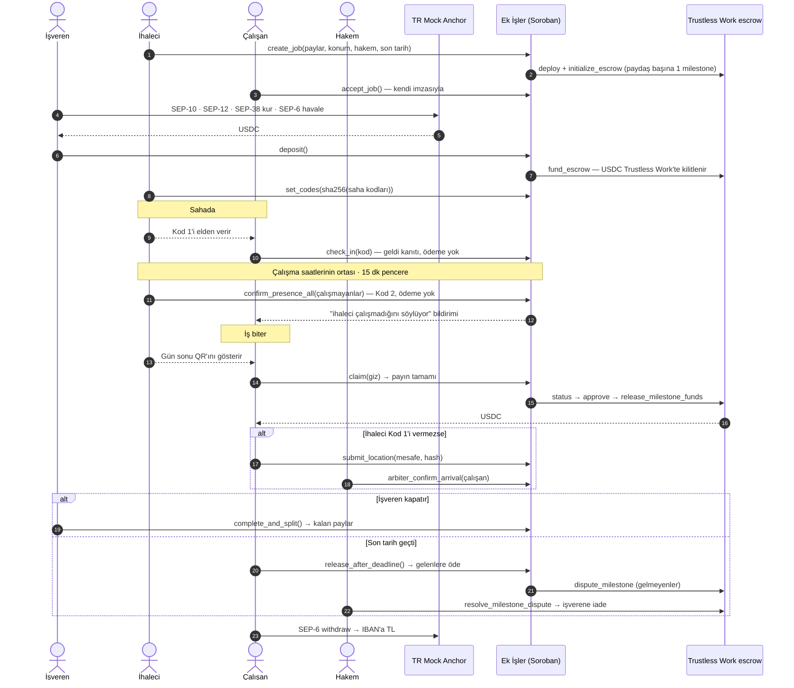
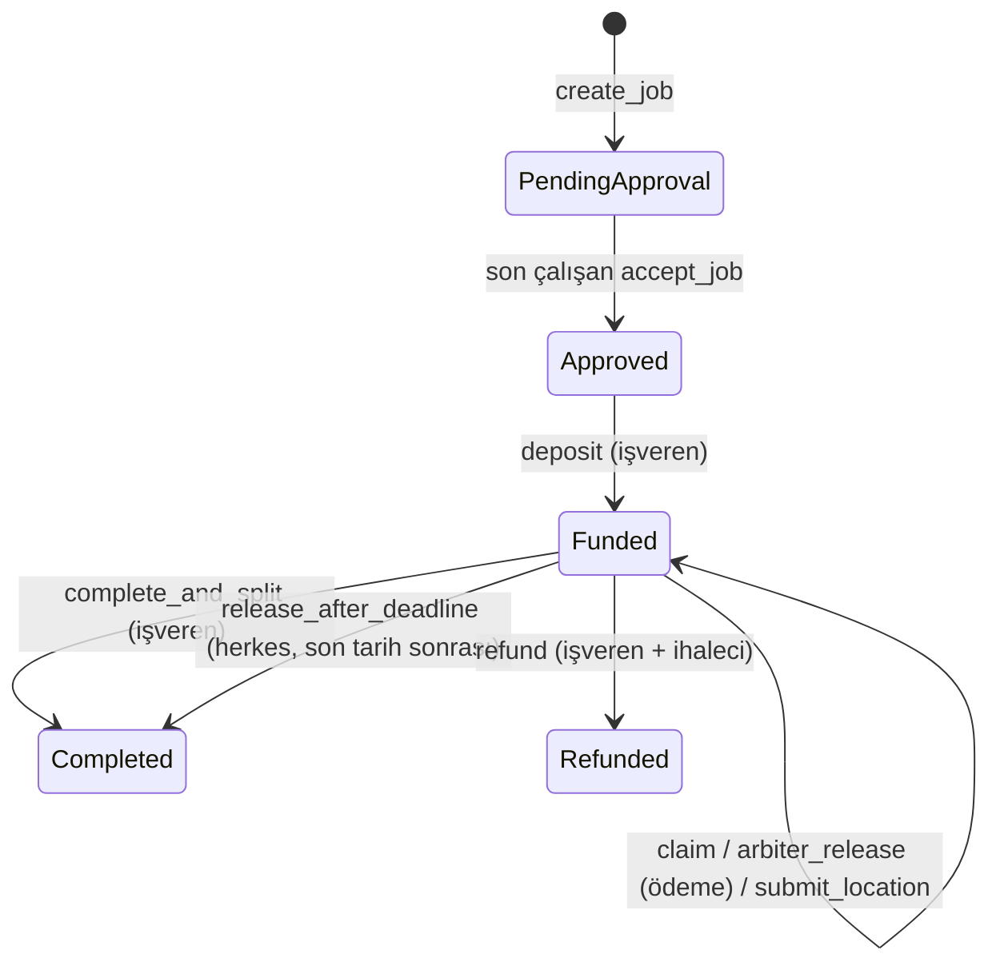

# Ek İşler

**Kısa süreli işlerde ödemeyi aracıya değil, akıllı sözleşmeye emanet eden, çalışan onaylı ve sahada QR ile ilerleyen ödeme paylaşımı.**

Stellar Hackathon Türkiye 2026 · Stellar Testnet · Soroban + **Trustless Work** escrow + TR Mock Anchor (SEP-1/10/12/38/6) + Stellar Wallets Kit

---

## Problem

Hafta sonu e-spor turnuvası, festival, fuar, çeviri işi, sahne kurulumu… Bu işlerde işi alan bir **ihaleci** (taşeron lideri) vardır, o da işi yürütmek için **alt çalışanlar** tutar (ör. Japonca ve İspanyolca tercümanlar).

1. **Tahsilat stresi:** İşveren parayı ihaleciye öder; ihaleci çalışanın payını geç ya da eksik yatırır. Çalışan günlerce "param yattı mı?" diye bekler.
2. **Gizli oran hilesi:** İhaleci çalışanla sözlü olarak %32'de anlaşır, sisteme habersizce %20 yazar.
3. **Sahadaki güven:** Çalışan yola çıkar, işveren "gelmedin" der. Ya da çalışan hiç gelmez, işveren son dakikada ortada kalır.
4. **Regülasyon duvarı:** Bir yazılım şirketinin müşteriden para toplayıp kendi havuzunda tutarak üçüncü kişilere dağıtması, 6493 sayılı kanun kapsamında TCMB lisansı gerektirir.

## Çözüm

Para hiçbir şirketin hesabına girmez. Her iş için açılan bir **Trustless Work multi-release escrow**'unda kilitlenir; işin kuralları **Ek İşler Soroban kontratında** kodla işletilir:

| Kural | Nasıl sağlanıyor |
|---|---|
| Oran hilesi yapılamaz | İhaleci payları yazar, ama **her çalışan kendi payını cüzdan imzasıyla onaylamadan** işveren para yatıramaz. İhaleci onayları dışarıdan dolduramaz. |
| **Kod 1** · yüz yüze eşleşme | İhaleci sahada çalışana 12 karakterlik kodu (`K7M2-QX9F-4B3T`) **elden** verir; çalışan uygulamasına yazınca işe geldiği zincire yazılır. **Para hareket etmez.** |
| **Kod 2** · devam kontrolü | İş kurulurken girilen **çalışma saatlerinin tam ortasında** ihaleciye tek bir bildirim gider ve **15 dakika** açık kalır: "çalışanlar iş yerinde ve çalışıyor mu?". İhaleci çalışmayanları işaretler; işaretlenen her çalışana **anında bildirim** düşer: *"İhaleci çalışmadığını söylüyor."* Pencerenin açılma anı ve süresi zincirde yazılıdır, dışında yoklama yapılamaz. **Para hareket etmez.** |
| **Gün sonu QR'ı** · ödeme | Parayı aktaran tek adım. İş bitince ihaleci QR'ı gösterir, çalışan okutur ve **payının tamamı** anında hesabına geçer. |
| **Konum** · takip | Kod 1 girildiği anda **kendiliğinden başlar**, gün sonu ödemesinde biter ve konum **çalışanın cihazında** işlenir. Alandan çıkılırsa yalnızca mesafe zincire yazılır ve ihaleciye bildirim gider. Ham koordinat zincire hiç yazılmaz. |
| İhaleci Kod 1'i vermezse | Çalışan konum kanıtı (mesafe + ham ölçümün hash'i) kaydeder; tarafların baştan kabul ettiği **hakem** çalışanı gelmiş işaretler, böylece son tarih ödemesine dahil olur. |
| İşveren de mağdur olmaz | İşveren işi kapatmadan son tarih geçerse: işe gelen (kaporası açılmış) çalışanlar kalan paylarını alır, **hiç gelmeyenlerin payı işverene döner**. |
| Para aracıda değil | Her paydaşın payı Trustless Work escrow'unda ayrı bir **milestone**'dur ve alıcısı paydaşın kendisidir. Ek İşler kontratı yalnızca koşul sağlanınca milestone'u onaylayıp serbest bıraktırır; para hiçbir an Ek İşler'de durmaz. |
| Anlaşmazlık | Hiç gelmeyen çalışanın milestone'ları Trustless Work'te **dispute**'a alınır; hakem (dispute resolver) işverene iade eder. |
| Türk Lirası ile giriş-çıkış | İşveren TL havale eder → anchor USDC'ye çevirir (SEP-38 + SEP-6). Çalışan USDC'yi IBAN'ına TL olarak çeker. |

**Katman ayrımı ve gizlilik:** Zincirde yalnızca para ve karar izi durur: kod hash'leri, hangi dilimin açıldığı, Kod 2 cevabı, alandan çıkış mesafesi. Ham GPS koordinatı, kimlik ve IBAN zincire yazılmaz. Konum ölçümleri (tuzlanmış hash'leriyle) sadece çalışanın cihazında tutulur; anlaşmazlıkta hakeme gösterilip zincirdeki hash'le doğrulanabilir. Alandan çıkış, Kod 2 "burada değil" cevabı gibi olaylar **otomatik dispute açmaz**, yalnızca bildirimdir (GPS sapmasıyla yanlış alarm riskine karşı); karar hakemdedir.

**Kodlar neden güvenli?** Kodlar işverenin cihazında 32 baytlık rastgele sayılar olarak üretilir. Zincire, para kilitlenirken yalnızca **sha256 hash'leri** yazılır. Çalışan bir kodu ancak işverenin ekranındaki QR'ı okutarak öğrenebilir. Bu hem sahada olduğunu hem de işverenin o anki onayını kanıtlar. Her kod tek bir çalışana ve tek bir dilime aittir; başkasının kodu ya da ikinci kullanım reddedilir.

## Demo akışı (≈4 dk)

Uygulamanın üstünde 5 hazır **demo testnet hesabı** var: Müşteri (işveren), İhaleci, 2 Tercüman ve Hakem. Tek tarayıcıda rolleri değiştirerek tüm akışı gösterebilirsin. **"Cüzdan bağla"** ile Freighter, xBull, Lobstr vb. gerçek bir cüzdanla da herhangi bir rolü oynayabilirsin.

1. **Demo hesaplarını hazırla**: Friendbot ile XLM + USDC trustline.
2. 🏢 **Müşteri → TL ⇄ USDC**: Cüzdanla giriş (SEP-10) → KYC (SEP-12) → 1000 TL için kur (SEP-38) → havale talimatı (SEP-6 deposit-exchange) → *Havaleyi gönder* → ~20 USDC hesaba gelir.
3. 🧑‍💼 **İhaleci → Yeni iş**: işveren, 20 USDC, paylar %50 / %32 / %18, **çalışma saatleri** (demoda *2 dk* hazır seçeneği), etkinlik konumu (Grand Pera), hakem → `create_job`. Form, Kod 2 yoklamasının tam olarak ne zaman açılacağını gösterir.
4. 🇯🇵 🇪🇸 **Tercümanlar → İşler**: *Payımı ve şartları onayla* (`accept_job`).
5. 🏢 **Müşteri**: *Parayı escrow'a kilitle* (`deposit`). 🧑‍💼 **İhaleci**: *Saha kodlarını oluştur* (`set_codes`) → her çalışan için Kod 1 ve gün sonu QR'ı hazır.
6. 🇯🇵 **Japonca tercüman**: ihaleci *Kod 1'i göster* der, çalışan kodu yazar (`check_in`) → **para hareket etmez**, zincire "geldi" yazılır. Konum takibi kendiliğinden başlar (demoda *Demo: alandan çık*).
7. 🧑‍💼 **İhaleci**: alandan çıkış uyarısını görür. Çalışma süresinin ortasında **Kod 2 bildirimi** düşer ve 15 dakikalık geri sayım başlar: çalışmayanları işaretleyip gönderir (`confirm_presence_all`). İşaretlenen çalışanın ekranına anında "ihaleci çalışmadığını söylüyor" bildirimi gelir. Para hareket etmez.
8. 🇪🇸 **İspanyolca tercüman**: ihaleci Kod 1'i vermiyor → *Konumumu al* → *Kanıt olarak gönder* (`submit_location`). ⚖️ **Hakem**: etkinliğe 37 m → *Gelmiş olarak işaretle* (`arbiter_confirm_arrival`).
9. 🇯🇵 **Tercüman**: iş bitti, ihalecinin *gün sonu QR'ını* okutur (`claim`) → **payının tamamı** anında hesabına geçer. 🏢 **Müşteri**: *İşi kapat* (`complete_and_split`) → kalan paylar ödenir.
10. 🇯🇵 **Tercüman → TL ⇄ USDC**: *Tümü* → *TL olarak çek* (SEP-6 withdraw).

## Mimari

### Trustless Work entegrasyonu

```
İşveren ──fund──▶ Trustless Work multi-release escrow (her iş için bir tane)
                    milestone 0: ihaleci payı            → alıcı: ihaleci
                    milestone 1-3: w1 varış/mesai/bitiş  → alıcı: w1
                    milestone 4-6: w2 varış/mesai/bitiş  → alıcı: w2
                    roller: approver, service provider, release signer, platform = Ek İşler kontratı
                            dispute resolver = hakem
Ek İşler kontratı: QR kodu doğrular → change_milestone_status → approve_milestone → release_milestone_funds
```

- Escrow kontratı, Trustless Work'ün resmi deposundan ([`trustlesswork-smart-contract-stellar`](https://github.com/Trustless-Work/trustlesswork-smart-contract-stellar), `multi-release-develop`, testnet hattı) derlenir; wasm'ı [`vendor/trustless-work`](vendor/trustless-work) altında. Ek İşler kontratı `create_job` sırasında bu wasm'dan işe özel bir escrow deploy edip `initialize_escrow` çağırır.
- Escrow'lar Trustless Work'ün kendi **[Escrow Viewer](https://viewer.trustlesswork.com)**'ında görünür: V1 · Multi-release, roller, milestone'lar ve tüm event'ler.
- Trustless Work her serbest bırakmada **%0,3 protokol ücreti** keser (testnet'te ücret adresi parametredir, mainnet'te kontrata gömülüdür).
- Trustless Work her onayda escrow'un tamamını event olarak yayınladığı için kapanış, işlem başına 16 KB event sınırına takılmamak adına en fazla 3 milestone'luk parçalar halinde yapılır (`continue_close`, arayüz otomatik devam ettirir).





### Bileşenler

| Klasör | İçerik |
|---|---|
| [`contracts/ek_isler`](contracts/ek_isler/src/lib.rs) | Soroban kontratı (Rust, soroban-sdk 28) + [16 birim testi](contracts/ek_isler/src/test.rs), testler gerçek Trustless Work wasm'ıyla çalışır |
| [`vendor/trustless-work`](vendor/trustless-work) | Trustless Work multi-release escrow wasm'ı (kaynak ve commit bilgisi `SOURCE.txt`'de) |
| [`frontend/src/lib/contract.ts`](frontend/src/lib/contract.ts) | Kontrat istemcisi (`@stellar/stellar-sdk` `contract.Client`, spec zincirden okunur) |
| [`frontend/src/lib/codes.ts`](frontend/src/lib/codes.ts) | Saha kodları: üretim, sha256 taahhüdü, QR formatı, mesafe hesabı |
| [`frontend/src/lib/camera.ts`](frontend/src/lib/camera.ts) | Kamera izni ve görüntü akışı: önceden izin isteme, hata nedenini ayrıştırma, kamera seçimi |
| [`frontend/src/lib/anchor.ts`](frontend/src/lib/anchor.ts) | SEP-1, SEP-10, SEP-12, SEP-38, SEP-6 istemcisi |
| [`frontend/src/lib/wallet.ts`](frontend/src/lib/wallet.ts) | Stellar Wallets Kit entegrasyonu + demo hesapları |
| [`frontend/scripts/e2e.ts`](frontend/scripts/e2e.ts) | Tarayıcısız uçtan uca testnet senaryosu |
| [`frontend/scripts/e2e-dispute.ts`](frontend/scripts/e2e-dispute.ts) | Gelmeyen çalışan → Trustless Work dispute → hakem iadesi senaryosu |

### Kontrat arayüzü

| Fonksiyon | Kim çağırır | Ne yapar |
|---|---|---|
| `create_job(contractor, terms) -> u64` | İhaleci | Şartları doğrular ve işe özel **Trustless Work escrow**'unu deploy edip milestone'larla başlatır. Paylar toplamı %100, tekrar eden adres yok, hakem taraflardan biri olamaz, çalışma saatleri son tarihi geçemez. |
| `accept_job(job_id, worker)` | Çalışan | Payını ve şartları imzasıyla kabul eder. Son onayla `Approved`. |
| `deposit(job_id)` | İşveren | Trustless Work escrow'unu fonlar (`fund_escrow`). |
| `set_codes(job_id, commitments)` | İhaleci | Her paydaş için Kod 1 ve gün sonu QR gizinin sha256'sını kaydeder. Ödenmemiş paylar için yenilenebilir (ihaleci cihaz değiştirirse). |
| `check_in(job_id, worker, code)` | Çalışan | **Kod 1**: elden verilen kodu doğrular, çalışanı *gelmiş* işaretler. **Para hareket etmez.** |
| `claim(job_id, worker, code) -> i128` | Çalışan | **Gün sonu QR'ı**: gizi doğrular ve payın tamamını Trustless Work'ten ödetir. |
| `confirm_presence_all(job_id, absent)` | İhaleci | **Kod 2**: ihaleciye giden tek bildirimin yanıtı. `absent` listesindekilere "çalışmıyor" uyarısı düşer, kalanlar çalışıyor sayılır. Tek işlemde tüm ekip. **Para hareket etmez.** |
| `confirm_presence(job_id, worker, present)` | İhaleci | Kod 2'nin tek çalışanlık hâli. Aynı pencere kuralına tabidir. **Para hareket etmez.** |
| `presence_window(terms) -> (u64, u64)` | Okuma | Yoklamanın açık olduğu aralık: çalışma saatlerinin ortası ve + 15 dakika. |
| `submit_location(job_id, worker, distance_m, reading_hash)` | Çalışan | Etkinliğe mesafe + ham ölçümün hash'i. Mesafe yarıçapı aşarsa işverene "alandan çıktı" uyarısı. |
| `arbiter_confirm_arrival(job_id, worker)` | Hakem | Konum kanıtına göre çalışanı *gelmiş* işaretler (ödeme değil); son tarih ödemesine dahil eder. |
| `arbiter_release(job_id, worker) -> i128` | Hakem | Çalışanın payını son tarihi beklemeden serbest bıraktırır. |
| `complete_and_split(job_id)` | İşveren | Tüm açık milestone'ları serbest bıraktırır (parça parça). |
| `release_after_deadline(job_id)` | Herkes | Son tarih sonrası: gelenlerin milestone'larını serbest bıraktırır, gelmeyenlerinkini Trustless Work'te dispute'a alır. |
| `continue_close(job_id)` | Herkes | Parçalara bölünmüş kapanışı sürdürür. |
| `refund(job_id)` | İşveren **ve** ihaleci | Karşılıklı iptal; açılmış dilimler çalışanda kalır, açılmamışlar dispute'a alınır ve hakem işverene iade eder. |
| `get_job`, `job_count` | Okuma | Görünüm fonksiyonları. |

Olaylar (`#[contractevent]`): `JobCreated`, `JobAccepted`, `JobFunded`, `CodesSet`, `CheckedIn`, `PresenceChecked`, `PaymentReleased`, `AlertRaised`, `LocationSubmitted`, `JobClosed`. Hakem, dispute'ları doğrudan Trustless Work escrow'undaki `resolve_milestone_dispute` ile çözer.
Depolama: her iş kendi `persistent` kaydında, her erişimde TTL 30 güne uzatılır.

## Testnet

| | |
|---|---|
| Ek İşler kontratı | [`CDBJP7A23SWXIPMCPEDKYYI5N6HWDO6Y22CLBW66YLFGGKMRLIOMR2NE`](https://stellar.expert/explorer/testnet/contract/CDBJP7A23SWXIPMCPEDKYYI5N6HWDO6Y22CLBW66YLFGGKMRLIOMR2NE) |
| Trustless Work escrow wasm hash | `3c42a38069af01f4332aba5e5817bf0415070d5f47d184a9c42c5133433af6d0` |
| Örnek Trustless Work escrow'u | [`CD773WTP…` Escrow Viewer'da](https://viewer.trustlesswork.com/testnet/v1/CD773WTPJE7Y6AWFM7FT43VOW6TL5IGOX3JDVRXAC6PPGSEZ4GJH6TZJ) |
| Dispute örneği (gelmeyen çalışan) | [`CAAE6JI2…` Escrow Viewer'da](https://viewer.trustlesswork.com/testnet/v1/CAAE6JI2D3LRSGPUGJXJ72MVFD3DVKRXZFCEINUCL7ZR7UCZ52NUSUPB) |
| USDC (SAC) | `CBIELTK6YBZJU5UP2WWQEUCYKLPU6AUNZ2BQ4WWFEIE3USCIHMXQDAMA` (issuer `GBBD47IF…LFLA5`) |
| Anchor | [`tr-mock-anchor.fly.dev`](https://tr-mock-anchor.fly.dev) |

Örnek uçtan uca çalıştırmadan işlemler:

| Adım | İşlem |
|---|---|
| SEP-6 deposit (1000 TL → 20.39 USDC) | [`037df027…`](https://stellar.expert/explorer/testnet/tx/037df0276e0f2026a579a09b034ae36b6e6448ef0d9e1f621974022535ac17a6) |
| `create_job` + Trustless Work escrow deploy | [`6030176e…`](https://stellar.expert/explorer/testnet/tx/6030176e39911003dc8dc50e95a4b9409619feeb72ceaf5575d2520fb8adfdb2) |
| `deposit` → `fund_escrow` | [`7311dbbd…`](https://stellar.expert/explorer/testnet/tx/7311dbbdfdad99b7458adac55b9dab58aca5b0957f8eec1d2690380de7e2cc13) |
| Varış QR → kapora milestone'u | [`de40497a…`](https://stellar.expert/explorer/testnet/tx/de40497adf2d9b3ff9b28a055f99786c79e9ae3987f6c3ffe2a0c425d4ea5423) |
| Mesai QR → milestone | [`a9d0dfc6…`](https://stellar.expert/explorer/testnet/tx/a9d0dfc66d5fccd1a93331a661f30a5ad01cd62b863db8cff206f14205c64075) |
| Konum kanıtı | [`dedde90a…`](https://stellar.expert/explorer/testnet/tx/dedde90a703570c0f8bf97a84ab84d402b3925685109d1ffd71fbc9f71f7c323) |
| Hakem kaporayı açtı | [`654e6c88…`](https://stellar.expert/explorer/testnet/tx/654e6c883c90dd1e8a6eae7ce08d2bcc92920ac507d823d460d5d1bcfa3d460a) |
| `complete_and_split` | [`f509ed18…`](https://stellar.expert/explorer/testnet/tx/f509ed181c22eefb1162f41594d0980a18e0359abcdabc1f6f6d0f3d6fe28c21) |
| Gelmeyen çalışan: `release_after_deadline` → dispute | [`17c309c4…`](https://stellar.expert/explorer/testnet/tx/17c309c42d65a8a7b35e3b3f4d14a86ea81982089c9567d7848c3d85ddcfb662) |
| Hakem `resolve_milestone_dispute` → işverene iade | [`69ea146d…`](https://stellar.expert/explorer/testnet/tx/69ea146d27901ff1edc1e15cd65b1f6646bc22d62cd687d36db41931066803c7) |
| SEP-6 withdraw (6.51 USDC → 315.77 TL) | [`88c6cf1a…`](https://stellar.expert/explorer/testnet/tx/88c6cf1a5bdcf48ce30e76defc4a87ae0286eeb1484b105286d5f6c6c39f8c0b) |

## Çalıştırma

Gereksinimler: Node 22+, Rust + `wasm32v1-none` hedefi, [Stellar CLI](https://github.com/stellar/stellar-cli) 23+.

```bash
# Kontrat testleri
cargo test

# Frontend
cd frontend
npm install
npm run dev          # http://localhost:5173
npm run dev:https    # telefondan denemek için: https://<yerel-ip>:5173

# Tarayıcısız uçtan uca testnet senaryoları (yeni hesaplar açar)
node scripts/e2e.ts
node scripts/e2e-dispute.ts
```

> Kamera ve konum yalnızca **güvenli kaynakta** (https ya da localhost) açılır. Telefondan
> `http://<yerel-ip>:5173` açarsanız gün sonu QR'ı okutulamaz; `npm run dev:https` kullanın
> ve sertifika uyarısında "yine de devam et" deyin.

Kendi kontratını deploy etmek istersen:

```bash
stellar contract build
stellar keys generate deployer --network testnet --fund
TW=$(stellar contract upload --wasm vendor/trustless-work/multi_release_escrow.wasm --source-account deployer --network testnet)
stellar contract deploy --wasm target/wasm32v1-none/release/ek_isler.wasm --source-account deployer --network testnet \
  -- --tw_wasm $TW --tw_fee_address <USDC trustline'ı olan bir G adresi>
# çıkan ID'yi frontend/.env içine yaz:  VITE_CONTRACT_ID=C...
```

## Partner entegrasyonu

- **Trustless Work**: Paranın tutulduğu katman. Her iş, Trustless Work'ün multi-release escrow kontratının ayrı bir örneğidir; her ödeme dilimi bir milestone, her dispute Trustless Work'ün dispute mekanizmasıyla hakem tarafından çözülür. Escrow'lar Trustless Work Escrow Viewer'da doğrudan incelenebilir.
- **Stellar Wallets Kit**: Freighter, xBull, Lobstr, Albedo, Hana, Rabet, WalletConnect… tek API ile. Hem kontrat işlemleri hem SEP-10 challenge imzası kit üzerinden yapılır.
- **TR Mock Anchor**: SEP-1 keşif, SEP-10 kimlik, SEP-12 KYC, SEP-38 kilitli kur (firm quote), SEP-6 `deposit-exchange` ve `withdraw`. Anchor ürünün iş mantığının bir parçası: işverenin fonlama adımı ve çalışanın ödeme alma adımı anchor üzerinden gerçekleşiyor.

## Güvenlik notları ve bilinen sınırlar

- **Konum parayı asla kendiliğinden hareket ettirmez**: tasarım gereği yalnızca bildirim ve hakeme sunulan bir girdidir. Ödemeyi açan tek şey gün sonu QR'ı, hakem kararı ya da son tarih kuralıdır.
- **İki kod türü bilerek farklı uzunlukta.** Kod taahhütleri (sha256) zincirde herkese açıktır, yani kısa bir kod hash'ten geri bulunabilir. **Kod 1** elle yazıldığı için kısa olmak zorunda: 32 harfli alfabeden 12 karakter (60 bit) — elle yazılabilir ama kaba kuvvetle bulunamaz, karışan harfler (I, L, O, U) alfabede yok. **Gün sonu QR'ı** yalnızca kamerayla okunduğu için kısa olma zorunluluğu yok: 32 baytlık tam rastgele giz (256 bit). Parayı aktaran adımın en güçlü giz olması bilinçli bir tercih. Kod 1 uzunluğu `frontend/src/lib/codes.ts` içindeki `CODE_LENGTH` ile belirlenir.
- Saha kodları ihalecinin tarayıcısında saklanır; cihaz değişirse ihaleci `set_codes` ile yenilerini üretir, ödenmiş paylar etkilenmez.
- Trustless Work her serbest bırakmada %0,3 protokol ücreti keser; çalışana geçen net tutar buna göre biraz düşüktür.
- Trustless Work escrow'u en fazla 50 milestone alır: iş başına ihaleci + en fazla 24 çalışan.
- Demo hesaplarının anahtarları **yalnızca testnet** içindir ve tarayıcının `localStorage`'ında durur. Anchor JWT'si sadece bellekte tutulur.
- Kontrat token adresini ihaleciye bırakıyor; arayüz her zaman testnet USDC kullanıyor. Üretimde token beyaz listesi eklenmeli.
- Bir çalışan onayladıktan sonra USDC trustline'ını kaldırırsa ona yapılan transfer başarısız olur; arayüz onay adımında trustline'ı otomatik açıyor.
- `refund` iki imza istediği için arayüzde yok; CLI veya çok imzalı akışla yapılır.

## Yol haritası

- **Trustless Work V2 / REST API**: Escrow'ları Trustless Work API'si ve indexer'ı üzerinden de yönetmek (V2 testnet'te beta).
- **DeFindex**: Escrow'da bekleyen USDC'yi etkinlik süresince vault'ta değerlendirmek (fixed-APR stratejisiyle ön çalışma yapıldı).
- Konum kanıtını güçlendirme: cihaz doğrulaması, çoklu tanık, zaman aralıklı check-in.
- Kısmi hakem kararları ve itiraz süresi.
- Gerçek anchor ile mainnet: e-fatura / stopaj entegrasyonu.

## Lisans

MIT
