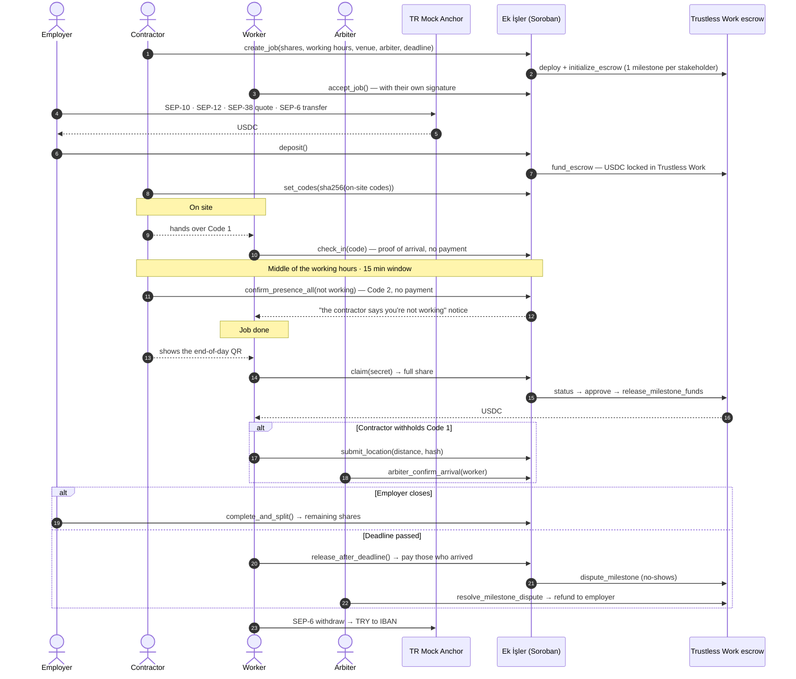
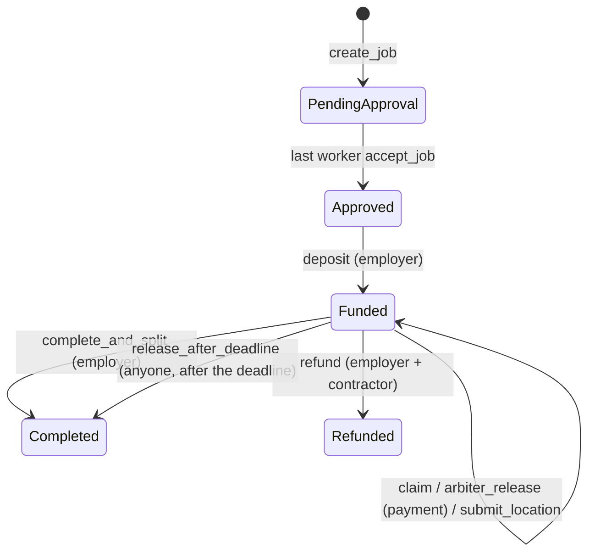

# Ek İşler

**[English](#english) · [Türkçe](#türkçe)**

Stellar Hackathon Türkiye 2026 · Stellar Testnet · Soroban + **Trustless Work** escrow + TR Mock Anchor (SEP-1/10/12/38/6) + Stellar Wallets Kit

**Live demo:** [ekisler.vercel.app](https://ekisler.vercel.app) · **Contract:** [`CBPHNMV5…72BMT`](https://stellar.expert/explorer/testnet/contract/CBPHNMV5DZ3IFT43GRQ6NS65U5W6KTRBENHK3NWFUXJCWTIK3BD72BMT)

---

<a id="english"></a>

# English

**A payment split for short-term gigs where the money sits in a smart contract instead of with a middleman. Every worker signs off on their own share, and on-site steps are proven with codes and a QR.**

## Problem

Weekend e-sports tournaments, festivals, trade fairs, interpreting jobs, stage builds… A **contractor** (crew lead) wins the job and hires **workers** to deliver it (e.g. an Italian interpreter, a camera operator, a photographer).

1. **Payment anxiety:** The employer pays the contractor; the contractor pays the worker late or short. The worker waits for days wondering whether the money will arrive.
2. **Hidden share fraud:** The contractor verbally agrees on 32% with a worker, then quietly enters 20% in the system.
3. **Trust on site:** The worker shows up and the employer says "you never came". Or the worker never shows up and the employer is left stranded at the last minute.
4. **Regulatory wall:** In Türkiye, a software company collecting money from clients, holding it in its own pool and distributing it to third parties needs a central bank (TCMB) licence under Law No. 6493.

## Solution

The money never enters any company's account. It is locked in a **Trustless Work multi-release escrow** opened for each job, and the job's rules are enforced in code by the **Ek İşler Soroban contract**:

| Rule | How it is enforced |
|---|---|
| No share fraud | The contractor writes the shares, but the employer **cannot fund the job until every worker has accepted their own share with a wallet signature**. The contractor cannot fill in approvals on anyone's behalf. |
| **Code 1** · in-person check-in | On site, the contractor gives the worker a 12-character code (`K7M2-QX9F-4B3T`) **in person**; when the worker types it into the app, their arrival is written on-chain. **No money moves.** |
| **Code 2** · roll call | Exactly **in the middle of the working hours** entered when the job was created, the contractor gets a single notification that stays open for **15 minutes**: "are the workers on site and working?". The contractor marks anyone who isn't; each marked worker **instantly gets a notice**: *"The contractor says you're not working."* The window is enforced on-chain; no roll call is possible outside it. **No money moves.** |
| **End-of-day QR** · payment | The only step that moves money. When the job is done, the contractor shows the QR, the worker scans it, and **the full share** reaches their account instantly. |
| **Location** · tracking | Starts **automatically** when Code 1 is entered, ends at the end-of-day payment, and is processed **on the worker's device**. If the worker leaves the venue, only the distance is written on-chain and the contractor is notified. Raw coordinates never go on-chain. |
| If the contractor withholds Code 1 | The worker records a location proof (distance + hash of the raw reading); the **arbiter** agreed on up front marks them as arrived, so they are included in the deadline payout. |
| The employer is protected too | If the deadline passes without the employer closing the job, workers who showed up get their shares and **the shares of no-shows go back to the employer**. |
| No middleman holds the money | Each stakeholder's share is a separate **milestone** in the Trustless Work escrow whose receiver is that stakeholder. The Ek İşler contract only approves and releases a milestone when its condition is met; the money never sits with Ek İşler. |
| Disputes | The milestones of workers who never showed up are moved into **dispute** on Trustless Work; the arbiter (dispute resolver) refunds them to the employer. |
| Turkish lira in and out | The employer sends a TRY bank transfer → the anchor converts it to USDC (SEP-38 + SEP-6). The worker withdraws USDC to their IBAN in TRY. |

**Layers and privacy:** Only money and decision trails live on-chain: code hashes, who arrived, Code 2 answers, distance when leaving the venue. Raw GPS coordinates, identities and IBANs are never written on-chain. Location readings (with salted hashes) stay on the worker's device; in a dispute they can be shown to the arbiter and checked against the on-chain hash. Leaving the venue or a "not working" answer **never opens a dispute automatically**; they are notices only (to avoid false alarms from GPS drift), and the arbiter decides.

**Why are the codes safe?** The contractor's device generates both codes for every worker: a 12-character Code 1 and a 32-byte random end-of-day secret. Only their **sha256 hashes** go on-chain (`set_codes`); the codes themselves never leave the contractor's device. Each code belongs to one worker; someone else's code or a second use is rejected.

## Demo flow (≈4 min)

The app has ready-made **testnet demo accounts**: Employer, Contractor, three workers (Italian Interpreter, Camera Operator, Photographer) and Arbiter. **Add role** creates more worker accounts (e.g. "Waiter"). Switch roles in one browser to show the whole flow, or use **Connect your own wallet** (Freighter, xBull, Lobstr, …) to play any role with a real wallet. The UI is in English by default; TR/EN is switchable at the top right.

1. **Set up demo accounts**: Friendbot XLM + USDC trustline for every account, then ~20 test USDC for the employer through the anchor (SEP-6).
2. **Employer → TRY ⇄ USDC**: sign in with the wallet (SEP-10) → KYC (SEP-12) → quote for 1000 TRY (SEP-38) → transfer instructions (SEP-6 deposit-exchange) → *Send the transfer* → ~20 USDC arrives.
3. **Contractor → New job**: employer, 20 USDC, shares 40% / 20% / 20% / 20%, **working hours** (the *2 min* preset for the demo), venue (Grand Pera), arbiter → `create_job`. The form shows exactly when the Code 2 roll call will open.
4. **Workers → Jobs**: *Accept my share and the terms* (`accept_job`).
5. **Employer**: *Lock the money in escrow* (`deposit`). **Contractor**: *Create on-site codes* (`set_codes`) → Code 1 and an end-of-day QR are ready for each worker.
6. **Italian Interpreter**: the contractor taps *Show Code 1*, the worker types it (`check_in`) → **no money moves**, "arrived" is written on-chain. Location tracking starts automatically (*Demo: leave the venue* in the demo).
7. **Contractor**: sees the left-the-venue alert. In the middle of the shift the **Code 2 notification** arrives with a 15-minute countdown: mark anyone not working and send (`confirm_presence_all`). The marked worker instantly sees "the contractor says you're not working". No money moves.
8. **Camera Operator**: the contractor won't give Code 1 → *Get my location* → *Submit as proof* (`submit_location`). **Arbiter**: 37 m from the venue → *Mark as arrived* (`arbiter_confirm_arrival`).
9. **Italian Interpreter**: the job is done, they scan the contractor's *end-of-day QR* (`claim`) → **the full share** arrives instantly. **Employer**: *Close the job* (`complete_and_split`) → the remaining shares are paid.
10. **Italian Interpreter → TRY ⇄ USDC**: *All* → *Withdraw as TRY* (SEP-6 withdraw).

Every job card shows a **"Contract · this stage"** panel (the contract address, the functions callable at this stage and who calls them, and the last on-chain call) and an **"On-chain record"** that lists every step as the real contract call decoded from the transaction, e.g. `EkIsler.check_in(7, GCTZ…, 0x435a…)`, each linked to stellar.expert.

## Architecture

### Trustless Work integration

```
Employer ──fund──▶ Trustless Work multi-release escrow (one per job)
                     milestone 0: contractor's share   → receiver: contractor
                     milestone 1: worker 1's share     → receiver: worker 1
                     milestone 2: worker 2's share     → receiver: worker 2
                     …
                     roles: approver, service provider, release signer, platform = Ek İşler contract
                            dispute resolver = arbiter
Ek İşler contract: verifies the end-of-day QR → change_milestone_status → approve_milestone → release_milestone_funds
```

- The escrow contract is built from Trustless Work's official repository ([`trustlesswork-smart-contract-stellar`](https://github.com/Trustless-Work/trustlesswork-smart-contract-stellar), `multi-release-develop`, testnet line); its wasm lives in [`vendor/trustless-work`](vendor/trustless-work). During `create_job`, the Ek İşler contract deploys a job-specific escrow from this wasm and calls `initialize_escrow`.
- The escrows show up in Trustless Work's own **[Escrow Viewer](https://viewer.trustlesswork.com)**: V1 · Multi-release, roles, milestones and all events.
- Trustless Work charges a **0.3% protocol fee** on every release (the fee address is a parameter on testnet and hard-coded on mainnet).
- Trustless Work emits the whole escrow as an event on every approval, so closing runs in batches of at most 3 milestones to stay under the 16 KB per-transaction event limit (`continue_close`; the UI continues automatically).





### Components

| Folder | Contents |
|---|---|
| [`contracts/ek_isler`](contracts/ek_isler/src/lib.rs) | Soroban contract (Rust, soroban-sdk 28) + [24 unit tests](contracts/ek_isler/src/test.rs); the tests run against the real Trustless Work wasm |
| [`vendor/trustless-work`](vendor/trustless-work) | Trustless Work multi-release escrow wasm (source and commit in `SOURCE.txt`) |
| [`frontend/src/lib/contract.ts`](frontend/src/lib/contract.ts) | Contract client (`@stellar/stellar-sdk` `contract.Client`, spec read from the chain) |
| [`frontend/src/lib/codes.ts`](frontend/src/lib/codes.ts) | On-site codes: generation, sha256 commitments, QR format, distance |
| [`frontend/src/lib/events.ts`](frontend/src/lib/events.ts), [`txinfo.ts`](frontend/src/lib/txinfo.ts) | Per-job on-chain record from contract events; the contract call of each transaction decoded from its envelope |
| [`frontend/src/lib/camera.ts`](frontend/src/lib/camera.ts) | Camera permission and stream for QR scanning, with clear error states |
| [`frontend/src/lib/anchor.ts`](frontend/src/lib/anchor.ts) | SEP-1, SEP-10, SEP-12, SEP-38, SEP-6 client |
| [`frontend/src/lib/wallet.ts`](frontend/src/lib/wallet.ts) | Stellar Wallets Kit integration + demo accounts and user-added roles |
| [`frontend/src/lib/i18n.ts`](frontend/src/lib/i18n.ts) | English / Turkish UI |
| [`frontend/scripts/e2e.ts`](frontend/scripts/e2e.ts) | Headless end-to-end testnet scenario |
| [`frontend/scripts/e2e-dispute.ts`](frontend/scripts/e2e-dispute.ts) | No-show worker → Trustless Work dispute → arbiter refund scenario |

### Contract interface

| Function | Called by | What it does |
|---|---|---|
| `create_job(contractor, terms) -> u64` | Contractor | Validates the terms and deploys the job's **Trustless Work escrow** with its milestones. Shares total 100%, no duplicate addresses, the arbiter can't be a party, working hours can't go past the deadline. |
| `accept_job(job_id, worker)` | Worker | Accepts their share and the terms with their signature. The last approval moves the job to `Approved`. |
| `deposit(job_id)` | Employer | Locks the **full job amount** in the Trustless Work escrow (`fund_escrow`). Despite the name, this is not a down payment: no worker is paid at this step. |
| `set_codes(job_id, commitments)` | Contractor | Stores the sha256 of each stakeholder's Code 1 and end-of-day secret. Can be renewed for unpaid shares (if the contractor switches devices). |
| `check_in(job_id, worker, code)` | Worker | **Code 1**: verifies the code handed over in person and marks the worker as *arrived*. **No money moves.** |
| `claim(job_id, worker, code) -> i128` | Worker | **End-of-day QR**: verifies the secret and releases the full share from Trustless Work. |
| `confirm_presence_all(job_id, absent)` | Contractor | **Code 2**: the answer to the contractor's single notification. Workers in `absent` get a "not working" alert; the rest count as working. The whole crew in one transaction. **No money moves.** |
| `confirm_presence(job_id, worker, present)` | Contractor | Single-worker form of Code 2, same window rule. **No money moves.** |
| `presence_window(terms) -> (u64, u64)` | Read | The roll-call window: the middle of the working hours to + 15 minutes. |
| `submit_location(job_id, worker, distance_m, reading_hash)` | Worker | Distance to the venue + hash of the raw reading. If the distance exceeds the radius, the contractor gets a "left the venue" alert. |
| `arbiter_confirm_arrival(job_id, worker)` | Arbiter | Marks the worker as *arrived* based on location proof (not a payment); includes them in the deadline payout. |
| `arbiter_release(job_id, worker) -> i128` | Arbiter | Releases a worker's share without waiting for the deadline. |
| `complete_and_split(job_id)` | Employer | Releases all open milestones (in batches). |
| `release_after_deadline(job_id)` | Anyone | After the deadline: releases the milestones of those who arrived and moves the rest into dispute on Trustless Work. |
| `continue_close(job_id)` | Anyone | Continues a batched close. |
| `refund(job_id)` | Employer **and** contractor | Mutual cancellation; paid shares stay with the workers, unpaid ones go into dispute and the arbiter refunds the employer. |
| `get_job`, `job_count` | Read | View functions. |

Events (`#[contractevent]`): `JobCreated`, `JobAccepted`, `JobFunded`, `CodesSet`, `CheckedIn`, `PresenceChecked`, `PaymentReleased`, `AlertRaised`, `LocationSubmitted`, `JobClosed`. The arbiter resolves disputes directly on the Trustless Work escrow with `resolve_milestone_dispute`.
Storage: each job has its own `persistent` entry; its TTL is extended to 30 days on every access.

## Testnet

| | |
|---|---|
| Ek İşler contract | [`CBPHNMV5DZ3IFT43GRQ6NS65U5W6KTRBENHK3NWFUXJCWTIK3BD72BMT`](https://stellar.expert/explorer/testnet/contract/CBPHNMV5DZ3IFT43GRQ6NS65U5W6KTRBENHK3NWFUXJCWTIK3BD72BMT) |
| Trustless Work escrow wasm hash | `3c42a38069af01f4332aba5e5817bf0415070d5f47d184a9c42c5133433af6d0` |
| Sample Trustless Work escrow | [`CCP4T3O5…` in the Escrow Viewer](https://viewer.trustlesswork.com/testnet/v1/CCP4T3O5SC6BG23XGYU32RRQ3VM6E2NF6F2XVVTHMEL3CP7NEGTRPQ7J) |
| USDC (SAC) | `CBIELTK6YBZJU5UP2WWQEUCYKLPU6AUNZ2BQ4WWFEIE3USCIHMXQDAMA` (issuer `GBBD47IF…LFLA5`) |
| Anchor | [`tr-mock-anchor.fly.dev`](https://tr-mock-anchor.fly.dev) |

Sample transactions (job #9 with three workers, plus the arbiter, location and withdrawal steps from the end-to-end script):

| Step | Transaction |
|---|---|
| `create_job` + Trustless Work escrow deploy | [`3a8b9011…`](https://stellar.expert/explorer/testnet/tx/3a8b9011b697e77d0941efe98c9aacb5625eec4f7205ce91d9151029175b9d0d) |
| `accept_job` (worker signature) | [`3e0845c9…`](https://stellar.expert/explorer/testnet/tx/3e0845c91b7151bc89a266eeabd453e858121e641d6f9c059e36f9c60a7f6753) |
| `deposit` → `fund_escrow` | [`d9f52a3c…`](https://stellar.expert/explorer/testnet/tx/d9f52a3c344b798ee004ca255ae129aa7f189ffaa761761cf01551b7e3a0447b) |
| `set_codes` (sha256 commitments only) | [`56afeebe…`](https://stellar.expert/explorer/testnet/tx/56afeebeaea7e9f1536426ad9123ef336bc95476b367ebca4387a61242caecc9) |
| Code 1 · `check_in` (no payment) | [`cbaad67b…`](https://stellar.expert/explorer/testnet/tx/cbaad67b4704403056e039f17941d6a18477adde2ff556a58442b8c12c7ab339) |
| Code 2 · `confirm_presence_all` (no payment) | [`64de63bc…`](https://stellar.expert/explorer/testnet/tx/64de63bc23332011b7c1a94946b01b0f5f8652a49e5f3dd76cdfe7bff616ca87) |
| End-of-day QR · `claim` → full share | [`5490c38f…`](https://stellar.expert/explorer/testnet/tx/5490c38feac08ee9a1073e04a9841533e31f0c2f1fc8bf4498c06d4c71e9dd35) |
| Location proof · `submit_location` | [`14be3916…`](https://stellar.expert/explorer/testnet/tx/14be391643ae2c1c094bbf4ada9a5f08f716c1a8d5d46e1be5e021cc8073be36) |
| Arbiter · `arbiter_confirm_arrival` | [`c1ff5eac…`](https://stellar.expert/explorer/testnet/tx/c1ff5eac4f31ab3b19670f8994c00f73ceae5b17820227b852a14ad4124b98f3) |
| Arbiter · `arbiter_release` | [`cb6d8789…`](https://stellar.expert/explorer/testnet/tx/cb6d87896778e40f8103d11822c093be58d9914d5adf4699fa3ae5dc29463b6e) |
| `complete_and_split` | [`0c1ac57c…`](https://stellar.expert/explorer/testnet/tx/0c1ac57c1b03821d8f16f25c014505a77f8bddc50e31eb943670730c98ffd497) |
| SEP-6 withdraw (6.51 USDC → 315.77 TRY) | [`ba6d245f…`](https://stellar.expert/explorer/testnet/tx/ba6d245ff54cc67b4bc6cfaa17763d170dc322521d13fcd796afad6fe426df28) |

## Running it

Requirements: Node 22+, Rust + the `wasm32v1-none` target, [Stellar CLI](https://github.com/stellar/stellar-cli) 23+.

```bash
# Contract tests
cargo test

# Frontend
cd frontend
npm install
npm run dev          # http://localhost:5173

# Headless end-to-end testnet scenarios (open fresh accounts)
node scripts/e2e.ts
node scripts/e2e-dispute.ts
```

To deploy your own contract:

```bash
stellar contract build
stellar keys generate deployer --network testnet --fund
TW=$(stellar contract upload --wasm vendor/trustless-work/multi_release_escrow.wasm --source-account deployer --network testnet)
stellar contract deploy --wasm target/wasm32v1-none/release/ek_isler.wasm --source-account deployer --network testnet \
  -- --tw_wasm $TW --tw_fee_address <a G address with a USDC trustline>
# put the resulting ID in frontend/.env:  VITE_CONTRACT_ID=C...
```

## Partner integrations

- **Trustless Work**: the layer that holds the money. Each job is its own instance of Trustless Work's multi-release escrow contract; each share is a milestone, and disputes are resolved by the arbiter through Trustless Work's dispute mechanism. Escrows can be inspected directly in the Trustless Work Escrow Viewer.
- **Stellar Wallets Kit**: Freighter, xBull, Lobstr, Albedo, Hana, Rabet, WalletConnect… through one API. Both contract transactions and the SEP-10 challenge are signed through the kit.
- **TR Mock Anchor**: SEP-1 discovery, SEP-10 authentication, SEP-12 KYC, SEP-38 firm quotes, SEP-6 `deposit-exchange` and `withdraw`. The anchor is part of the product flow: the employer funds and the worker cashes out through it.

## Security notes and known limits

- **Location never moves money on its own**: by design it is only a notice and an input for the arbiter. Only the end-of-day QR, an arbiter decision or the deadline rule releases a payment.
- **The two code types have different lengths on purpose.** Code commitments (sha256) are public on-chain, so a short code could be brute-forced from its hash. **Code 1** is typed by hand, so it has to be short: 12 characters from a 32-letter alphabet (60 bits), typeable but not guessable, with confusable letters (I, L, O, U) removed. The **end-of-day QR** is only scanned, so it doesn't need to be short: a full 32-byte random secret (256 bits). The step that moves money has the strongest secret. Code 1's length is `CODE_LENGTH` in `frontend/src/lib/codes.ts`.
- On-site codes are stored in the contractor's browser; if they switch devices, `set_codes` issues new ones and paid shares are unaffected.
- Trustless Work charges a 0.3% protocol fee on every release, so the net amount a worker receives is slightly lower.
- A Trustless Work escrow takes at most 50 milestones: the contractor + up to 49 workers per job.
- Demo account keys are **testnet only** and live in the browser's `localStorage`. The anchor JWT is kept in memory only.
- The contract lets the contractor choose the token; the UI always uses testnet USDC. Production needs a token allow-list.
- If a worker removes their USDC trustline after accepting, transfers to them fail; the UI opens the trustline automatically at the accept step.
- `refund` needs two signatures, so it is not in the UI; it is done via the CLI or a multi-sig flow.
- Camera QR scanning, GPS tracking and OS notifications need a real phone over https; they are verified in code paths and the headless scripts, not yet on a physical device.

## Roadmap

- **Trustless Work V2 / REST API**: also manage escrows through the Trustless Work API and indexer (V2 is in beta on testnet).
- **DeFindex**: put USDC waiting in escrow to work in a vault during the event (early work done with a fixed-APR strategy).
- Stronger location proof: device attestation, multiple witnesses, timed check-ins.
- Partial arbiter decisions and an appeal period.
- Mainnet with a real anchor: e-invoice / withholding tax integration.

## Licence

MIT

---

<a id="türkçe"></a>

# Türkçe

**Kısa süreli işlerde ödemeyi aracıya değil, akıllı sözleşmeye emanet eden, çalışan onaylı ve sahada kod ve QR ile ilerleyen ödeme paylaşımı.**

## Problem

Hafta sonu e-spor turnuvası, festival, fuar, çeviri işi, sahne kurulumu… Bu işlerde işi alan bir **ihaleci** (taşeron lideri) vardır, o da işi yürütmek için **alt çalışanlar** tutar (ör. İtalyanca çevirmen, kameraman, fotoğrafçı).

1. **Tahsilat stresi:** İşveren parayı ihaleciye öder; ihaleci çalışanın payını geç ya da eksik yatırır. Çalışan günlerce "param yattı mı?" diye bekler.
2. **Gizli oran hilesi:** İhaleci çalışanla sözlü olarak %32'de anlaşır, sisteme habersizce %20 yazar.
3. **Sahadaki güven:** Çalışan yola çıkar, işveren "gelmedin" der. Ya da çalışan hiç gelmez, işveren son dakikada ortada kalır.
4. **Regülasyon duvarı:** Bir yazılım şirketinin müşteriden para toplayıp kendi havuzunda tutarak üçüncü kişilere dağıtması, 6493 sayılı kanun kapsamında TCMB lisansı gerektirir.

## Çözüm

Para hiçbir şirketin hesabına girmez. Her iş için açılan bir **Trustless Work multi-release escrow**'unda kilitlenir; işin kuralları **Ek İşler Soroban kontratında** kodla işletilir:

| Kural | Nasıl sağlanıyor |
|---|---|
| Oran hilesi yapılamaz | İhaleci payları yazar, ama **her çalışan kendi payını cüzdan imzasıyla onaylamadan** işveren para yatıramaz. İhaleci onayları dışarıdan dolduramaz. |
| **Kod 1** · yüz yüze eşleşme | İhaleci sahada çalışana 12 karakterlik kodu (`K7M2-QX9F-4B3T`) **elden** verir; çalışan uygulamasına yazınca işe geldiği zincire yazılır. **Para hareket etmez.** |
| **Kod 2** · yoklama | İş kurulurken girilen **çalışma saatlerinin tam ortasında** ihaleciye tek bir bildirim gider ve **15 dakika** açık kalır: "çalışanlar iş yerinde ve çalışıyor mu?". İhaleci çalışmayanları işaretler; işaretlenen her çalışana **anında bildirim** düşer: *"İhaleci çalışmadığını söylüyor."* Pencere zincirde zorunludur, dışında yoklama yapılamaz. **Para hareket etmez.** |
| **Gün sonu QR'ı** · ödeme | Parayı aktaran tek adım. İş bitince ihaleci QR'ı gösterir, çalışan okutur ve **payının tamamı** anında hesabına geçer. |
| **Konum** · takip | Kod 1 girildiği anda **kendiliğinden başlar**, gün sonu ödemesinde biter ve konum **çalışanın cihazında** işlenir. Alandan çıkılırsa yalnızca mesafe zincire yazılır ve ihaleciye bildirim gider. Ham koordinat zincire hiç yazılmaz. |
| İhaleci Kod 1'i vermezse | Çalışan konum kanıtı (mesafe + ham ölçümün hash'i) kaydeder; tarafların baştan kabul ettiği **hakem** çalışanı gelmiş işaretler, böylece son tarih ödemesine dahil olur. |
| İşveren de mağdur olmaz | İşveren işi kapatmadan son tarih geçerse: işe gelen (Kod 1'i girmiş) çalışanlar paylarını alır, **hiç gelmeyenlerin payı işverene döner**. |
| Para aracıda değil | Her paydaşın payı Trustless Work escrow'unda ayrı bir **milestone**'dur ve alıcısı paydaşın kendisidir. Ek İşler kontratı yalnızca koşul sağlanınca milestone'u onaylayıp serbest bıraktırır; para hiçbir an Ek İşler'de durmaz. |
| Anlaşmazlık | Hiç gelmeyen çalışanın milestone'u Trustless Work'te **dispute**'a alınır; hakem (dispute resolver) işverene iade eder. |
| Türk Lirası ile giriş-çıkış | İşveren TL havale eder → anchor USDC'ye çevirir (SEP-38 + SEP-6). Çalışan USDC'yi IBAN'ına TL olarak çeker. |

**Katman ayrımı ve gizlilik:** Zincirde yalnızca para ve karar izi durur: kod hash'leri, kimin geldiği, Kod 2 cevabı, alandan çıkış mesafesi. Ham GPS koordinatı, kimlik ve IBAN zincire yazılmaz. Konum ölçümleri (tuzlanmış hash'leriyle) sadece çalışanın cihazında tutulur; anlaşmazlıkta hakeme gösterilip zincirdeki hash'le doğrulanabilir. Alandan çıkış ya da "çalışmıyor" cevabı **otomatik dispute açmaz**, yalnızca bildirimdir (GPS sapmasıyla yanlış alarm riskine karşı); karar hakemdedir.

**Kodlar neden güvenli?** İhalecinin cihazı her çalışan için iki kod üretir: 12 karakterlik Kod 1 ve 32 baytlık rastgele gün sonu gizi. Zincire yalnızca **sha256 hash'leri** yazılır (`set_codes`); kodların kendisi ihalecinin cihazından çıkmaz. Her kod tek bir çalışana aittir; başkasının kodu ya da ikinci kullanım reddedilir.

## Demo akışı (≈4 dk)

Uygulamada hazır **testnet demo hesapları** var: İşveren, İhaleci, üç çalışan (İtalyanca Çevirmen, Kameraman, Fotoğrafçı) ve Hakem. **Rol ekle** ile yeni çalışan hesapları açılabilir (ör. "Garson"). Tek tarayıcıda rolleri değiştirerek tüm akışı gösterebilirsin; **Kendi cüzdanını bağla** ile Freighter, xBull, Lobstr vb. gerçek bir cüzdanla da herhangi bir rolü oynayabilirsin. Arayüz varsayılan olarak İngilizce; TR/EN sağ üstten değişir.

1. **Demo hesaplarını hazırla**: her hesaba Friendbot ile XLM + USDC trustline, ardından işverene anchor üzerinden (SEP-6) ~20 test USDC'si.
2. **İşveren → TRY ⇄ USDC**: Cüzdanla giriş (SEP-10) → KYC (SEP-12) → 1000 TL için kur (SEP-38) → havale talimatı (SEP-6 deposit-exchange) → *Havaleyi gönder* → ~20 USDC hesaba gelir.
3. **İhaleci → Yeni iş**: işveren, 20 USDC, paylar %40 / %20 / %20 / %20, **çalışma saatleri** (demoda *2 dk* hazır seçeneği), etkinlik konumu (Grand Pera), hakem → `create_job`. Form, Kod 2 yoklamasının tam olarak ne zaman açılacağını gösterir.
4. **Çalışanlar → İşler**: *Payımı ve şartları onayla* (`accept_job`).
5. **İşveren**: *Parayı escrow'a kilitle* (`deposit`). **İhaleci**: *Saha kodlarını oluştur* (`set_codes`) → her çalışan için Kod 1 ve gün sonu QR'ı hazır.
6. **İtalyanca Çevirmen**: ihaleci *Kod 1'i göster* der, çalışan kodu yazar (`check_in`) → **para hareket etmez**, zincire "geldi" yazılır. Konum takibi kendiliğinden başlar (demoda *Demo: alandan çık*).
7. **İhaleci**: alandan çıkış uyarısını görür. Çalışma süresinin ortasında **Kod 2 bildirimi** düşer ve 15 dakikalık geri sayım başlar: çalışmayanları işaretleyip gönderir (`confirm_presence_all`). İşaretlenen çalışanın ekranına anında "ihaleci çalışmadığını söylüyor" bildirimi gelir. Para hareket etmez.
8. **Kameraman**: ihaleci Kod 1'i vermiyor → *Konumumu al* → *Kanıt olarak gönder* (`submit_location`). **Hakem**: etkinliğe 37 m → *Gelmiş olarak işaretle* (`arbiter_confirm_arrival`).
9. **İtalyanca Çevirmen**: iş bitti, ihalecinin *gün sonu QR'ını* okutur (`claim`) → **payının tamamı** anında hesabına geçer. **İşveren**: *İşi kapat* (`complete_and_split`) → kalan paylar ödenir.
10. **İtalyanca Çevirmen → TRY ⇄ USDC**: *Tümü* → *TL olarak çek* (SEP-6 withdraw).

Her iş kartında **"Kontrat · bu aşama"** kutusu (kontrat adresi, o aşamada çağrılabilen fonksiyonlar ve kimin çağırdığı, zincirdeki son çağrı) ve her adımı işlem zarfından okunan gerçek kontrat çağrısıyla gösteren **"Zincir kaydı"** var; ör. `EkIsler.check_in(7, GCTZ…, 0x435a…)`, her biri stellar.expert'e linkli.

## Mimari

Trustless Work entegrasyonu, akış ve durum diyagramları için [İngilizce bölümdeki Architecture](#architecture) kısmına bakın; kontrat aynıdır. Özetle:

- Her iş için bir Trustless Work multi-release escrow'u açılır; **paydaş başına bir milestone** vardır ve alıcısı paydaşın kendisidir. Approver, service provider, release signer ve platform rolleri Ek İşler kontratıdır; dispute resolver hakemdir.
- Ek İşler kontratı gün sonu QR'ını doğrular → `change_milestone_status` → `approve_milestone` → `release_milestone_funds`.
- Escrow wasm'ı Trustless Work'ün resmi deposundan derlenir ([`vendor/trustless-work`](vendor/trustless-work)); escrow'lar Trustless Work **[Escrow Viewer](https://viewer.trustlesswork.com)**'ında görünür.
- Trustless Work her serbest bırakmada **%0,3 protokol ücreti** keser. Kapanış, işlem başına 16 KB event sınırına takılmamak için en fazla 3 milestone'luk parçalarla yapılır (`continue_close`, arayüz otomatik devam ettirir).

### Kontrat arayüzü

| Fonksiyon | Kim çağırır | Ne yapar |
|---|---|---|
| `create_job(contractor, terms) -> u64` | İhaleci | Şartları doğrular ve işe özel **Trustless Work escrow**'unu deploy edip milestone'larla başlatır. Paylar toplamı %100, tekrar eden adres yok, hakem taraflardan biri olamaz, çalışma saatleri son tarihi geçemez. |
| `accept_job(job_id, worker)` | Çalışan | Payını ve şartları imzasıyla kabul eder. Son onayla `Approved`. |
| `deposit(job_id)` | İşveren | İşin **tüm bedelini** Trustless Work escrow'una kilitler (`fund_escrow`). Adı "deposit" olsa da kapora değildir: bu adımda hiçbir çalışana ödeme yapılmaz. |
| `set_codes(job_id, commitments)` | İhaleci | Her paydaş için Kod 1 ve gün sonu QR gizinin sha256'sını kaydeder. Ödenmemiş paylar için yenilenebilir (ihaleci cihaz değiştirirse). |
| `check_in(job_id, worker, code)` | Çalışan | **Kod 1**: elden verilen kodu doğrular, çalışanı *gelmiş* işaretler. **Para hareket etmez.** |
| `claim(job_id, worker, code) -> i128` | Çalışan | **Gün sonu QR'ı**: gizi doğrular ve payın tamamını Trustless Work'ten ödetir. |
| `confirm_presence_all(job_id, absent)` | İhaleci | **Kod 2**: ihaleciye giden tek bildirimin yanıtı. `absent` listesindekilere "çalışmıyor" uyarısı düşer, kalanlar çalışıyor sayılır. Tek işlemde tüm ekip. **Para hareket etmez.** |
| `confirm_presence(job_id, worker, present)` | İhaleci | Kod 2'nin tek çalışanlık hâli. Aynı pencere kuralına tabidir. **Para hareket etmez.** |
| `presence_window(terms) -> (u64, u64)` | Okuma | Yoklamanın açık olduğu aralık: çalışma saatlerinin ortası ve + 15 dakika. |
| `submit_location(job_id, worker, distance_m, reading_hash)` | Çalışan | Etkinliğe mesafe + ham ölçümün hash'i. Mesafe yarıçapı aşarsa ihaleciye "alandan çıktı" uyarısı. |
| `arbiter_confirm_arrival(job_id, worker)` | Hakem | Konum kanıtına göre çalışanı *gelmiş* işaretler (ödeme değil); son tarih ödemesine dahil eder. |
| `arbiter_release(job_id, worker) -> i128` | Hakem | Çalışanın payını son tarihi beklemeden serbest bıraktırır. |
| `complete_and_split(job_id)` | İşveren | Tüm açık milestone'ları serbest bıraktırır (parça parça). |
| `release_after_deadline(job_id)` | Herkes | Son tarih sonrası: gelenlerin milestone'larını serbest bıraktırır, gelmeyenlerinkini Trustless Work'te dispute'a alır. |
| `continue_close(job_id)` | Herkes | Parçalara bölünmüş kapanışı sürdürür. |
| `refund(job_id)` | İşveren **ve** ihaleci | Karşılıklı iptal; ödenmiş paylar çalışanda kalır, ödenmemişler dispute'a alınır ve hakem işverene iade eder. |
| `get_job`, `job_count` | Okuma | Görünüm fonksiyonları. |

Olaylar (`#[contractevent]`): `JobCreated`, `JobAccepted`, `JobFunded`, `CodesSet`, `CheckedIn`, `PresenceChecked`, `PaymentReleased`, `AlertRaised`, `LocationSubmitted`, `JobClosed`. Hakem, dispute'ları doğrudan Trustless Work escrow'undaki `resolve_milestone_dispute` ile çözer.
Depolama: her iş kendi `persistent` kaydında, her erişimde TTL 30 güne uzatılır.

## Testnet

Kontrat adresi, örnek escrow ve adım adım örnek işlemler için [İngilizce bölümdeki Testnet](#testnet) tablosuna bakın. Ek İşler kontratı: [`CBPHNMV5DZ3IFT43GRQ6NS65U5W6KTRBENHK3NWFUXJCWTIK3BD72BMT`](https://stellar.expert/explorer/testnet/contract/CBPHNMV5DZ3IFT43GRQ6NS65U5W6KTRBENHK3NWFUXJCWTIK3BD72BMT).

## Çalıştırma

Gereksinimler: Node 22+, Rust + `wasm32v1-none` hedefi, [Stellar CLI](https://github.com/stellar/stellar-cli) 23+.

```bash
# Kontrat testleri (24 test)
cargo test

# Frontend
cd frontend
npm install
npm run dev          # http://localhost:5173

# Tarayıcısız uçtan uca testnet senaryoları (yeni hesaplar açar)
node scripts/e2e.ts
node scripts/e2e-dispute.ts
```

Kendi kontratını deploy etmek için komutlar [İngilizce bölümdeki Running it](#running-it) kısmında; çıkan ID'yi `frontend/.env` içine `VITE_CONTRACT_ID=C...` olarak yaz.

**Windows notu:** Klasör adında Türkçe karakter olmasın (`stellar miraç` gibi bir yolda Rust'ın MinGW linker'ı dosyaları bulamıyor) ya da `CARGO_TARGET_DIR` ile derleme çıktısını başka yere yönlendir. Mock anchor'a IPv6 bağlantısı zaman aşımına uğrarsa Node'u IPv4'e zorla: `node --dns-result-order=ipv4first scripts/e2e.ts`.

## Partner entegrasyonu

- **Trustless Work**: Paranın tutulduğu katman. Her iş, Trustless Work'ün multi-release escrow kontratının ayrı bir örneğidir; her pay bir milestone, her dispute Trustless Work'ün dispute mekanizmasıyla hakem tarafından çözülür. Escrow'lar Trustless Work Escrow Viewer'da doğrudan incelenebilir.
- **Stellar Wallets Kit**: Freighter, xBull, Lobstr, Albedo, Hana, Rabet, WalletConnect… tek API ile. Hem kontrat işlemleri hem SEP-10 challenge imzası kit üzerinden yapılır.
- **TR Mock Anchor**: SEP-1 keşif, SEP-10 kimlik, SEP-12 KYC, SEP-38 kilitli kur (firm quote), SEP-6 `deposit-exchange` ve `withdraw`. Anchor ürünün iş mantığının bir parçası: işverenin fonlama adımı ve çalışanın ödeme alma adımı anchor üzerinden gerçekleşiyor.

## Güvenlik notları ve bilinen sınırlar

- **Konum parayı asla kendiliğinden hareket ettirmez**: tasarım gereği yalnızca bildirim ve hakeme sunulan bir girdidir. Ödemeyi açan tek şey gün sonu QR'ı, hakem kararı ya da son tarih kuralıdır.
- **İki kod türü bilerek farklı uzunlukta.** Kod taahhütleri (sha256) zincirde herkese açıktır, yani kısa bir kod hash'ten geri bulunabilir. **Kod 1** elle yazıldığı için kısa olmak zorunda: 32 harfli alfabeden 12 karakter (60 bit), elle yazılabilir ama kaba kuvvetle bulunamaz; karışan harfler (I, L, O, U) alfabede yok. **Gün sonu QR'ı** yalnızca kamerayla okunduğu için 32 baytlık tam rastgele gizdir (256 bit). Parayı aktaran adımın en güçlü giz olması bilinçli bir tercih. Kod 1 uzunluğu `frontend/src/lib/codes.ts` içindeki `CODE_LENGTH` ile belirlenir.
- Saha kodları ihalecinin tarayıcısında saklanır; cihaz değişirse ihaleci `set_codes` ile yenilerini üretir, ödenmiş paylar etkilenmez.
- Trustless Work her serbest bırakmada %0,3 protokol ücreti keser; çalışana geçen net tutar buna göre biraz düşüktür.
- Trustless Work escrow'u en fazla 50 milestone alır: iş başına ihaleci + en fazla 49 çalışan.
- Demo hesaplarının anahtarları **yalnızca testnet** içindir ve tarayıcının `localStorage`'ında durur. Anchor JWT'si sadece bellekte tutulur.
- Kontrat token adresini ihaleciye bırakıyor; arayüz her zaman testnet USDC kullanıyor. Üretimde token beyaz listesi eklenmeli.
- Bir çalışan onayladıktan sonra USDC trustline'ını kaldırırsa ona yapılan transfer başarısız olur; arayüz onay adımında trustline'ı otomatik açıyor.
- `refund` iki imza istediği için arayüzde yok; CLI veya çok imzalı akışla yapılır.
- Kamerayla QR okuma, GPS takibi ve işletim sistemi bildirimleri https üzerinden gerçek bir telefon ister; kod yolları ve tarayıcısız betiklerle doğrulandı, fiziksel cihazda henüz denenmedi.

## Yol haritası

- **Trustless Work V2 / REST API**: Escrow'ları Trustless Work API'si ve indexer'ı üzerinden de yönetmek (V2 testnet'te beta).
- **DeFindex**: Escrow'da bekleyen USDC'yi etkinlik süresince vault'ta değerlendirmek (fixed-APR stratejisiyle ön çalışma yapıldı).
- Konum kanıtını güçlendirme: cihaz doğrulaması, çoklu tanık, zaman aralıklı check-in.
- Kısmi hakem kararları ve itiraz süresi.
- Gerçek anchor ile mainnet: e-fatura / stopaj entegrasyonu.

## Lisans

MIT
