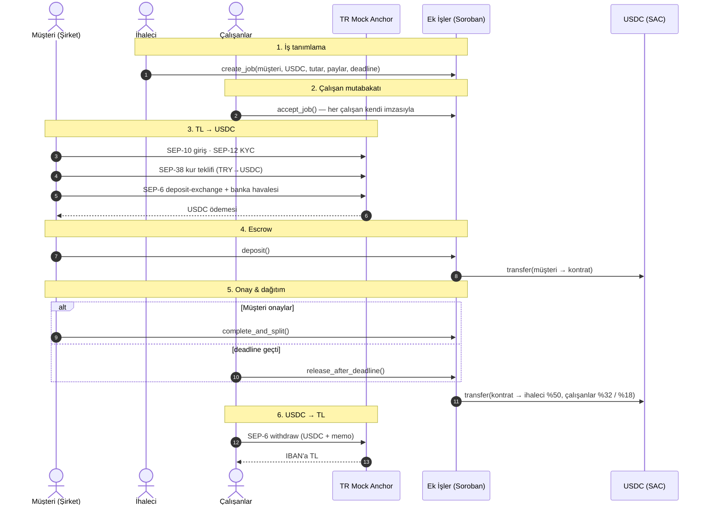
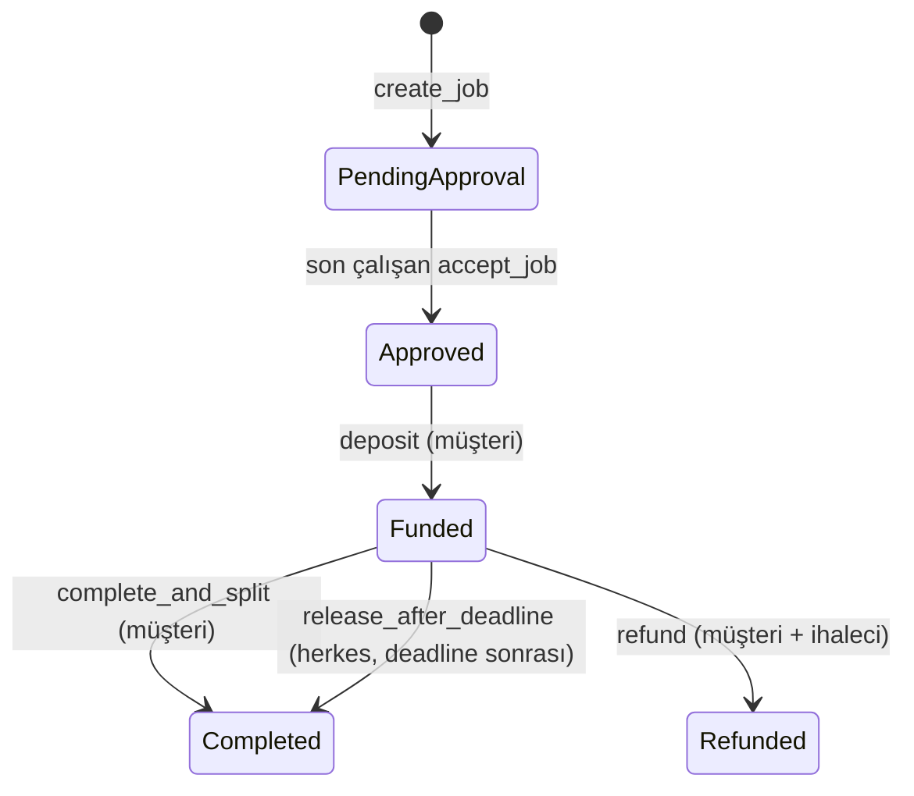

# Ek İşler

**Kısa süreli işlerde ödemeyi aracıya değil, akıllı sözleşmeye emanet eden, çalışan onaylı ödeme paylaşımı.**

Stellar Hackathon Türkiye 2026 · Stellar Testnet · Soroban + TR Mock Anchor (SEP-1/10/12/38/6) + Stellar Wallets Kit

---

## Problem

Hafta sonu e-spor turnuvası, festival, fuar, çeviri işi, sahne kurulumu… Bu işlerde işi alan bir **ihaleci** (taşeron lideri) vardır, o da işi yürütmek için **alt çalışanlar** tutar (ör. Japonca ve İspanyolca tercümanlar).

1. **Tahsilat stresi:** Müşteri parayı ihaleciye öder; ihaleci çalışanın payını geç ya da eksik yatırır. Çalışan günlerce "param yattı mı?" diye bekler.
2. **Gizli oran hilesi:** İhaleci çalışanla sözlü olarak %32'de anlaşır, sisteme habersizce %20 yazar.
3. **Regülasyon duvarı:** Bir yazılım şirketinin müşteriden para toplayıp kendi havuzunda tutarak üçüncü kişilere dağıtması, 6493 sayılı kanun kapsamında TCMB lisansı gerektirir.

## Çözüm

Para hiçbir şirketin hesabına girmez. **Soroban akıllı sözleşmesinde** kilitlenir ve kurallar kodla işletilir:

| Kural | Nasıl sağlanıyor |
|---|---|
| Oran hilesi yapılamaz | İhaleci payları yazar, ama **her çalışan kendi payını cüzdan imzasıyla (`require_auth`) onaylamadan** müşteri para yatıramaz. İhalecinin gönderdiği `accepted` alanı kontrat tarafından yok sayılır. |
| Para aracıda beklemez | Müşteri USDC'yi kontrata kilitler; işi onayladığı anda kontrat parayı **tek işlemde** paylara göre dağıtır. |
| Müşteri ortadan kaybolursa | `deadline` geçince **herkes** `release_after_deadline` çağırabilir; para sadece önceden onaylanmış adreslere gider. |
| Müşteri iş bitince parayı geri çekemez | İade (`refund`) **müşteri + ihaleci ortak imzası** ister. |
| Türk Lirası ile giriş-çıkış | Müşteri TL havale eder → anchor USDC'ye çevirir (SEP-38 + SEP-6). Çalışan USDC'yi IBAN'ına TL olarak çeker. |

## Demo akışı (≈3 dk)

Uygulamanın üstünde 4 hazır **demo testnet hesabı** var (Müşteri, İhaleci, 2 Tercüman). Tek tarayıcıda rolleri değiştirerek tüm akışı gösterebilirsin. İstersen **"Cüzdan bağla"** ile Freighter, xBull, Lobstr vb. gerçek bir cüzdanla da herhangi bir rolü oynayabilirsin.

1. **Demo hesaplarını hazırla**: Friendbot ile XLM + USDC trustline.
2. 🏢 **Müşteri → TL ⇄ USDC**: Cüzdanla giriş (SEP-10) → KYC (SEP-12) → 1000 TL için kur (SEP-38) → havale talimatı (SEP-6 deposit-exchange) → *Havaleyi gönder* → ~20 USDC hesaba gelir.
3. 🧑‍💼 **İhaleci → Yeni iş**: Müşteri, 20 USDC, pay dağılımı %50 / %32 / %18 → `create_job`.
4. 🇯🇵 🇪🇸 **Tercümanlar → İşler**: *Payımı onayla* (`accept_job`). Onaylar tamamlanmadan müşterinin "kilitle" butonu çalışmaz, kontrat `NotAllAccepted` döner.
5. 🏢 **Müşteri**: *Parayı escrow'a kilitle* (`deposit`) → iş bitince *İş tamamlandı · ödemeyi dağıt* (`complete_and_split`).
6. 🇯🇵 **Tercüman → TL ⇄ USDC**: *Tümü* → *TL olarak çek*. USDC anchor'a memo ile gönderilir, anchor IBAN'a TL öder (SEP-6 withdraw).

## Mimari





### Bileşenler

| Klasör | İçerik |
|---|---|
| [`contracts/ek_isler`](contracts/ek_isler/src/lib.rs) | Soroban escrow kontratı (Rust, soroban-sdk 28) + [9 birim testi](contracts/ek_isler/src/test.rs) |
| [`frontend/src/lib/contract.ts`](frontend/src/lib/contract.ts) | Kontrat istemcisi (`@stellar/stellar-sdk` `contract.Client`, spec zincirden okunur) |
| [`frontend/src/lib/anchor.ts`](frontend/src/lib/anchor.ts) | SEP-1, SEP-10, SEP-12, SEP-38, SEP-6 istemcisi |
| [`frontend/src/lib/wallet.ts`](frontend/src/lib/wallet.ts) | Stellar Wallets Kit entegrasyonu + demo hesapları |
| [`frontend/scripts/e2e.ts`](frontend/scripts/e2e.ts) | Tarayıcısız uçtan uca testnet senaryosu |

### Kontrat arayüzü

| Fonksiyon | Kim çağırır | Ne yapar |
|---|---|---|
| `create_job(client, contractor, token, total_amount, stakeholders, deadline) -> u64` | İhaleci | İşi yazar; payları doğrular (toplam 10000 bps, her pay > 0, tekrar eden adres yok). Çalışanların onayları `false` başlar. |
| `accept_job(job_id, worker)` | Çalışan | Kendi payını imzasıyla onaylar. Son onayla durum `Approved` olur. |
| `deposit(job_id)` | Müşteri | Tüm onaylar tamamsa USDC'yi kontrata kilitler. |
| `complete_and_split(job_id)` | Müşteri | Parayı paylara göre dağıtır; yuvarlama artığı ihaleciye gider. |
| `release_after_deadline(job_id)` | Herkes | Deadline geçtiyse aynı dağıtımı yapar. |
| `refund(job_id)` | Müşteri **ve** ihaleci | Karşılıklı iptal, parayı müşteriye iade eder. |
| `get_job(job_id)`, `job_count()` | Okuma | Frontend için görünüm fonksiyonları. |

Olaylar (`#[contractevent]`): `JobCreated`, `JobAccepted`, `JobFunded`, `JobPaid`, `JobRefunded`.
Depolama: her iş kendi `persistent` kaydında, her erişimde TTL 30 güne uzatılır.

## Testnet

| | |
|---|---|
| Kontrat | [`CCIR6DGYGHU7ZU3YUTV77CDPAALIL5FGLGTU5ZPWNGCF77QYEIAINKSN`](https://stellar.expert/explorer/testnet/contract/CCIR6DGYGHU7ZU3YUTV77CDPAALIL5FGLGTU5ZPWNGCF77QYEIAINKSN) |
| USDC (SAC) | `CBIELTK6YBZJU5UP2WWQEUCYKLPU6AUNZ2BQ4WWFEIE3USCIHMXQDAMA` (issuer `GBBD47IF…LFLA5`) |
| Anchor | [`tr-mock-anchor.fly.dev`](https://tr-mock-anchor.fly.dev) |

Örnek uçtan uca çalıştırmadan işlemler:

| Adım | İşlem |
|---|---|
| SEP-6 deposit (1000 TL → 20.39 USDC) | [`3ae2281c…`](https://stellar.expert/explorer/testnet/tx/3ae2281c54a904ad2f0986381443099aded424fedde0a75d32d40beea6569058) |
| `create_job` | [`61bb6741…`](https://stellar.expert/explorer/testnet/tx/61bb6741ee26a9b402bfe53788cd9f3d4ead8140b1d1cace1e69a4ffcfea6a80) |
| `accept_job` ×2 | [`e039ac09…`](https://stellar.expert/explorer/testnet/tx/e039ac09a91f993bf3317ef01695c77778a0a736d331411e08bdd0fa56953bc5) · [`96ab07ac…`](https://stellar.expert/explorer/testnet/tx/96ab07ac85f3736dbaf39838415b4a3168877a9107064c8bfee4de2d42c0c9a9) |
| `deposit` | [`a913aae0…`](https://stellar.expert/explorer/testnet/tx/a913aae0ddd4a95a9e11c325365e8ea143d00e228886445b1b3be1ecc4f54533) |
| `complete_and_split` | [`e6d03bdf…`](https://stellar.expert/explorer/testnet/tx/e6d03bdf872018c7baa3b9fb819f81ca8d66e3a09860e81dff6d593075277bb2) |
| SEP-6 withdraw (6.52 USDC → 316.72 TL) | [`7d8b80f1…`](https://stellar.expert/explorer/testnet/tx/7d8b80f19c97d420b45cca174c2de70e17b7b4da4bb6082de9243ed2444d4799) |

## Çalıştırma

Gereksinimler: Node 22+, Rust + `wasm32v1-none` hedefi, [Stellar CLI](https://github.com/stellar/stellar-cli) 23+.

```bash
# Kontrat testleri
cargo test

# Frontend
cd frontend
npm install
npm run dev          # http://localhost:5173

# Tarayıcısız uçtan uca testnet senaryosu (4 yeni hesap açar)
node scripts/e2e.ts
```

Kendi kontratını deploy etmek istersen:

```bash
stellar contract build
stellar keys generate deployer --network testnet --fund
stellar contract deploy --wasm target/wasm32v1-none/release/ek_isler.wasm --source-account deployer --network testnet
# çıkan ID'yi frontend/.env içine yaz:  VITE_CONTRACT_ID=C...
```

## Partner entegrasyonu

- **Stellar Wallets Kit**: Freighter, xBull, Lobstr, Albedo, Hana, Rabet, WalletConnect… tek API ile. Hem kontrat işlemleri hem SEP-10 challenge imzası kit üzerinden yapılır.
- **TR Mock Anchor**: SEP-1 keşif, SEP-10 kimlik, SEP-12 KYC, SEP-38 kilitli kur (firm quote), SEP-6 `deposit-exchange` ve `withdraw`. Anchor, ürünün iş mantığının bir parçası: müşterinin fonlama adımı ve çalışanın ödeme alma adımı anchor üzerinden gerçekleşiyor.

## Güvenlik notları ve bilinen sınırlar

- Demo hesaplarının anahtarları **yalnızca testnet** içindir ve tarayıcının `localStorage`'ında durur. Anchor JWT'si sadece bellekte tutulur.
- Kontrat token adresini ihaleciye bırakıyor. Arayüz her zaman testnet USDC kullanıyor; üretimde kontrat seviyesinde token beyaz listesi eklenmeli.
- Bir çalışan onayladıktan sonra USDC trustline'ını kaldırırsa dağıtım işlemi başarısız olur. Arayüz, onay adımında trustline'ı otomatik açıyor. Bu durumda para `refund` ile kurtarılabilir.
- `refund` iki imza istediği için arayüzde yok; CLI veya çok imzalı akışla yapılır.

## Yol haritası

- **DeFindex**: Escrow'da bekleyen USDC'yi etkinlik süresince vault'ta değerlendirmek; getiri müşteriye ya da çalışanlara.
- Hakem/itiraz akışı (üçüncü taraf hakem imzası).
- Kontrat seviyesinde token beyaz listesi, çoklu para birimi.
- Gerçek anchor ile mainnet: e-fatura / stopaj entegrasyonu.

## Lisans

MIT
