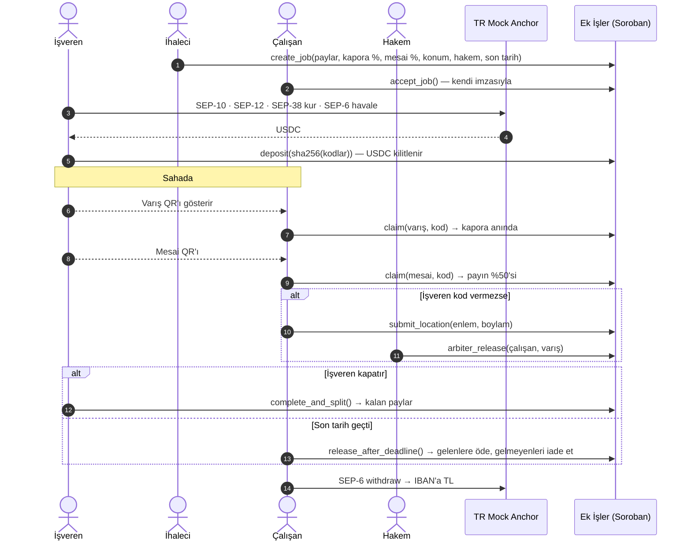
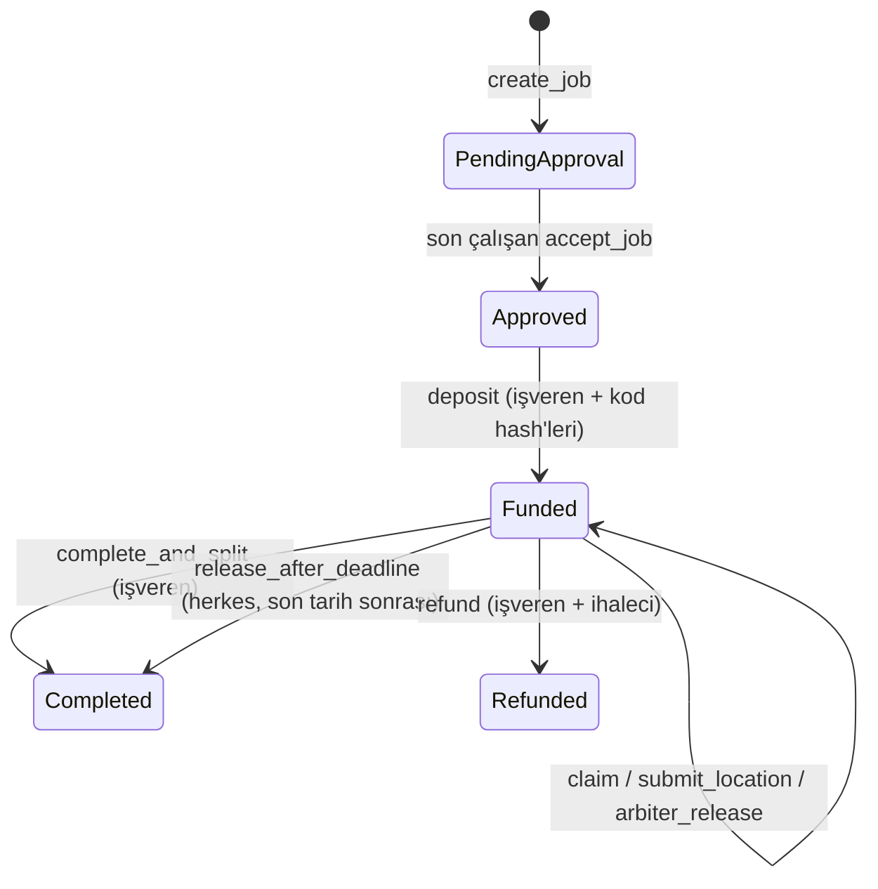

# Ek İşler

**Kısa süreli işlerde ödemeyi aracıya değil, akıllı sözleşmeye emanet eden, çalışan onaylı ve sahada QR ile ilerleyen ödeme paylaşımı.**

Stellar Hackathon Türkiye 2026 · Stellar Testnet · Soroban + TR Mock Anchor (SEP-1/10/12/38/6) + Stellar Wallets Kit

---

## Problem

Hafta sonu e-spor turnuvası, festival, fuar, çeviri işi, sahne kurulumu… Bu işlerde işi alan bir **ihaleci** (taşeron lideri) vardır, o da işi yürütmek için **alt çalışanlar** tutar (ör. Japonca ve İspanyolca tercümanlar).

1. **Tahsilat stresi:** İşveren parayı ihaleciye öder; ihaleci çalışanın payını geç ya da eksik yatırır. Çalışan günlerce "param yattı mı?" diye bekler.
2. **Gizli oran hilesi:** İhaleci çalışanla sözlü olarak %32'de anlaşır, sisteme habersizce %20 yazar.
3. **Sahadaki güven:** Çalışan yola çıkar, işveren "gelmedin" der. Ya da çalışan hiç gelmez, işveren son dakikada ortada kalır.
4. **Regülasyon duvarı:** Bir yazılım şirketinin müşteriden para toplayıp kendi havuzunda tutarak üçüncü kişilere dağıtması, 6493 sayılı kanun kapsamında TCMB lisansı gerektirir.

## Çözüm

Para hiçbir şirketin hesabına girmez. **Soroban akıllı sözleşmesinde** kilitlenir ve kurallar kodla işletilir:

| Kural | Nasıl sağlanıyor |
|---|---|
| Oran hilesi yapılamaz | İhaleci payları yazar, ama **her çalışan kendi payını cüzdan imzasıyla onaylamadan** işveren para yatıramaz. İhaleci onayları dışarıdan dolduramaz. |
| Çalışan geldiğini kanıtlar, kaporası anında yatar | İşveren sahada **Varış QR'ını** gösterir; çalışan okutunca kaporası (ör. payın %20'si) anında hesabına geçer. |
| Çalışma kanıtlanır | Mesai ortasında **Mesai QR'ı** ile ödenen tutar payın %50'sine çıkar. İş bitince **Bitiş QR'ı** kalan payı öder. |
| İşveren kod vermezse | Çalışan **konumunu zincire kaydeder**; tarafların baştan kabul ettiği **hakem** mesafeye bakıp kaporayı serbest bırakır. |
| İşveren de mağdur olmaz | İşveren işi kapatmadan son tarih geçerse: işe gelen (kaporası açılmış) çalışanlar kalan paylarını alır, **hiç gelmeyenlerin payı işverene döner**. |
| Türk Lirası ile giriş-çıkış | İşveren TL havale eder → anchor USDC'ye çevirir (SEP-38 + SEP-6). Çalışan USDC'yi IBAN'ına TL olarak çeker. |

**Kodlar neden güvenli?** Kodlar işverenin cihazında 32 baytlık rastgele sayılar olarak üretilir. Zincire, para kilitlenirken yalnızca **sha256 hash'leri** yazılır. Çalışan bir kodu ancak işverenin ekranındaki QR'ı okutarak öğrenebilir. Bu hem sahada olduğunu hem de işverenin o anki onayını kanıtlar. Her kod tek bir çalışana ve tek bir dilime aittir; başkasının kodu ya da ikinci kullanım reddedilir.

## Demo akışı (≈4 dk)

Uygulamanın üstünde 5 hazır **demo testnet hesabı** var: Müşteri (işveren), İhaleci, 2 Tercüman ve Hakem. Tek tarayıcıda rolleri değiştirerek tüm akışı gösterebilirsin. **"Cüzdan bağla"** ile Freighter, xBull, Lobstr vb. gerçek bir cüzdanla da herhangi bir rolü oynayabilirsin.

1. **Demo hesaplarını hazırla**: Friendbot ile XLM + USDC trustline.
2. 🏢 **Müşteri → TL ⇄ USDC**: Cüzdanla giriş (SEP-10) → KYC (SEP-12) → 1000 TL için kur (SEP-38) → havale talimatı (SEP-6 deposit-exchange) → *Havaleyi gönder* → ~20 USDC hesaba gelir.
3. 🧑‍💼 **İhaleci → Yeni iş**: işveren, 20 USDC, paylar %50 / %32 / %18, kapora %20, mesai %50, etkinlik konumu (Grand Pera), hakem → `create_job`.
4. 🇯🇵 🇪🇸 **Tercümanlar → İşler**: *Payımı ve şartları onayla* (`accept_job`).
5. 🏢 **Müşteri**: *Parayı kilitle ve saha QR kodlarını oluştur* (`deposit`). Her çalışan için Varış / Mesai / Bitiş QR'ları hazır.
6. 🇯🇵 **Japonca tercüman**: *İşverenin QR'ını okut* (telefonda kamera; tek cihazlık demoda *Demo: işverenin ekranındaki QR*) → kapora anında hesaba geçer (`claim`).
7. 🇪🇸 **İspanyolca tercüman**: işveren kod vermiyor → *Konumumu al* → *Kanıt olarak gönder* (`submit_location`).
8. ⚖️ **Hakem**: konum etkinliğe 37 m → *Varış (kapora) dilimini serbest bırak* (`arbiter_release`).
9. 🏢 **Müşteri**: *İşi kapat* (`complete_and_split`) → herkesin kalan payı ödenir.
10. 🇯🇵 **Tercüman → TL ⇄ USDC**: *Tümü* → *TL olarak çek* (SEP-6 withdraw).

## Mimari





### Bileşenler

| Klasör | İçerik |
|---|---|
| [`contracts/ek_isler`](contracts/ek_isler/src/lib.rs) | Soroban kontratı (Rust, soroban-sdk 28) + [13 birim testi](contracts/ek_isler/src/test.rs) |
| [`frontend/src/lib/contract.ts`](frontend/src/lib/contract.ts) | Kontrat istemcisi (`@stellar/stellar-sdk` `contract.Client`, spec zincirden okunur) |
| [`frontend/src/lib/codes.ts`](frontend/src/lib/codes.ts) | Saha kodları: üretim, sha256 taahhüdü, QR formatı, mesafe hesabı |
| [`frontend/src/lib/anchor.ts`](frontend/src/lib/anchor.ts) | SEP-1, SEP-10, SEP-12, SEP-38, SEP-6 istemcisi |
| [`frontend/src/lib/wallet.ts`](frontend/src/lib/wallet.ts) | Stellar Wallets Kit entegrasyonu + demo hesapları |
| [`frontend/scripts/e2e.ts`](frontend/scripts/e2e.ts) | Tarayıcısız uçtan uca testnet senaryosu |

### Kontrat arayüzü

| Fonksiyon | Kim çağırır | Ne yapar |
|---|---|---|
| `create_job(contractor, terms) -> u64` | İhaleci | İşveren, hakem, token, tutar, paylar, son tarih, kapora ve mesai oranları, etkinlik konumu. Paylar toplamı %100, tekrar eden adres yok, hakem taraflardan biri olamaz. |
| `accept_job(job_id, worker)` | Çalışan | Payını ve şartları imzasıyla kabul eder. Son onayla `Approved`. |
| `deposit(job_id, commitments)` | İşveren | USDC'yi kilitler; her çalışan × dilim için kodun sha256'sını kaydeder. |
| `claim(job_id, worker, tranche, code) -> i128` | Çalışan | Kodu doğrular, dilimin kümülatif hedefine kadar ödeme yapar. |
| `submit_location(job_id, worker, lat_e6, lng_e6)` | Çalışan | Konumu zaman damgasıyla kanıt olarak zincire yazar. |
| `arbiter_release(job_id, worker, tranche) -> i128` | Hakem | Kanıta göre bir dilimi açar. |
| `complete_and_split(job_id)` | İşveren | Herkesin kalan payını öder; yuvarlama artığı ihaleciye. |
| `release_after_deadline(job_id)` | Herkes | Son tarih sonrası: gelenlere kalanı öder, gelmeyenlerin payını işverene iade eder. |
| `refund(job_id)` | İşveren **ve** ihaleci | Karşılıklı iptal; açılmış dilimler çalışanda kalır, gerisi işverene döner. |
| `get_job`, `job_count` | Okuma | Görünüm fonksiyonları. |

Olaylar (`#[contractevent]`): `JobCreated`, `JobAccepted`, `JobFunded`, `TrancheReleased`, `LocationSubmitted`, `JobClosed`.
Depolama: her iş kendi `persistent` kaydında, her erişimde TTL 30 güne uzatılır.

## Testnet

| | |
|---|---|
| Kontrat | [`CCXWZQ7TJBP6MIMCG337KU4LW7JF66633TJUPAWGMW6QAE3NI53U5GFM`](https://stellar.expert/explorer/testnet/contract/CCXWZQ7TJBP6MIMCG337KU4LW7JF66633TJUPAWGMW6QAE3NI53U5GFM) |
| USDC (SAC) | `CBIELTK6YBZJU5UP2WWQEUCYKLPU6AUNZ2BQ4WWFEIE3USCIHMXQDAMA` (issuer `GBBD47IF…LFLA5`) |
| Anchor | [`tr-mock-anchor.fly.dev`](https://tr-mock-anchor.fly.dev) |

Örnek uçtan uca çalıştırmadan işlemler:

| Adım | İşlem |
|---|---|
| SEP-6 deposit (1000 TL → 20.39 USDC) | [`741e198e…`](https://stellar.expert/explorer/testnet/tx/741e198e4d6550cef6e6c0433ccfaeff4f83963abcbd5b44e045e6b0aeb13110) |
| `create_job` | [`818bbd9b…`](https://stellar.expert/explorer/testnet/tx/818bbd9b4761803a57578d079102f1a0727328a2b850af24d35b6dfc7c11a634) |
| `deposit` + kod hash'leri | [`8554544f…`](https://stellar.expert/explorer/testnet/tx/8554544ffa8274d5ca3bd733e618ab263c8d9e6c23577ea21b43f1e860f68ee1) |
| Varış QR → kapora (1.30 USDC) | [`ff8f8b8c…`](https://stellar.expert/explorer/testnet/tx/ff8f8b8c8c20cf62fc5f185fc117f4dacbdaa2d326b89f3a04712a79fcdbe228) |
| Mesai QR → %50 | [`5d8b17e4…`](https://stellar.expert/explorer/testnet/tx/5d8b17e4aa4c5ab0a887c1de9db9d74284926277b5e3e210478bfa6f54622bf4) |
| Konum kanıtı | [`c7ab5392…`](https://stellar.expert/explorer/testnet/tx/c7ab5392925604a475121c35a1694e2b44a3138c9fbecc4bd12fd1482a036fa8) |
| Hakem kaporayı açtı | [`5dadca96…`](https://stellar.expert/explorer/testnet/tx/5dadca96996f1e1191bf9e89ead24f689a0b6bfd6c57c9c389ed8d8987f29c59) |
| `complete_and_split` | [`11cfc567…`](https://stellar.expert/explorer/testnet/tx/11cfc567c88dafeb8319b086033b4289390f7e5adbb4624ffd6bf9e0ff9098ac) |
| SEP-6 withdraw (6.52 USDC → 316.72 TL) | [`5e2aecb2…`](https://stellar.expert/explorer/testnet/tx/5e2aecb286066a8b72f19740665bed56574368d436069965b484a1848ce9d529) |

## Çalıştırma

Gereksinimler: Node 22+, Rust + `wasm32v1-none` hedefi, [Stellar CLI](https://github.com/stellar/stellar-cli) 23+.

```bash
# Kontrat testleri
cargo test

# Frontend
cd frontend
npm install
npm run dev          # http://localhost:5173

# Tarayıcısız uçtan uca testnet senaryosu (5 yeni hesap açar)
node scripts/e2e.ts
```

Kendi kontratını deploy etmek istersen:

```bash
stellar contract build
stellar keys generate deployer --network testnet --fund
stellar contract deploy --wasm target/wasm32v1-none/release/ek_isler.wasm --source-account deployer --network testnet
# çıkan ID'yi frontend/.env içine yaz:  VITE_CONTRACT_ID=C...
```

## Partner entegrasyonu

- **Stellar Wallets Kit**: Freighter, xBull, Lobstr, Albedo, Hana, Rabet, WalletConnect… tek API ile. Hem kontrat işlemleri hem SEP-10 challenge imzası kit üzerinden yapılır.
- **TR Mock Anchor**: SEP-1 keşif, SEP-10 kimlik, SEP-12 KYC, SEP-38 kilitli kur (firm quote), SEP-6 `deposit-exchange` ve `withdraw`. Anchor ürünün iş mantığının bir parçası: işverenin fonlama adımı ve çalışanın ödeme alma adımı anchor üzerinden gerçekleşiyor.

## Güvenlik notları ve bilinen sınırlar

- **Konum kanıtı tek başına kesin değildir**: tarayıcı GPS'i sahte olabilir. Bu yüzden konum ödemeyi otomatik açmaz, tarafların kabul ettiği hakemin kararına girdi olur. Yol haritasında cihaz doğrulaması ve çoklu tanık var.
- Saha kodları işverenin tarayıcısında saklanır; cihaz değişirse QR'lar gösterilemez ama işveren işi yine *İşi kapat* ile tamamlayabilir.
- Demo hesaplarının anahtarları **yalnızca testnet** içindir ve tarayıcının `localStorage`'ında durur. Anchor JWT'si sadece bellekte tutulur.
- Kontrat token adresini ihaleciye bırakıyor; arayüz her zaman testnet USDC kullanıyor. Üretimde token beyaz listesi eklenmeli.
- Bir çalışan onayladıktan sonra USDC trustline'ını kaldırırsa ona yapılan transfer başarısız olur; arayüz onay adımında trustline'ı otomatik açıyor.
- `refund` iki imza istediği için arayüzde yok; CLI veya çok imzalı akışla yapılır.

## Yol haritası

- **DeFindex**: Escrow'da bekleyen USDC'yi etkinlik süresince vault'ta değerlendirmek (fixed-APR stratejisiyle ön çalışma yapıldı).
- Konum kanıtını güçlendirme: cihaz doğrulaması, çoklu tanık, zaman aralıklı check-in.
- Kısmi hakem kararları ve itiraz süresi.
- Gerçek anchor ile mainnet: e-fatura / stopaj entegrasyonu.

## Lisans

MIT
